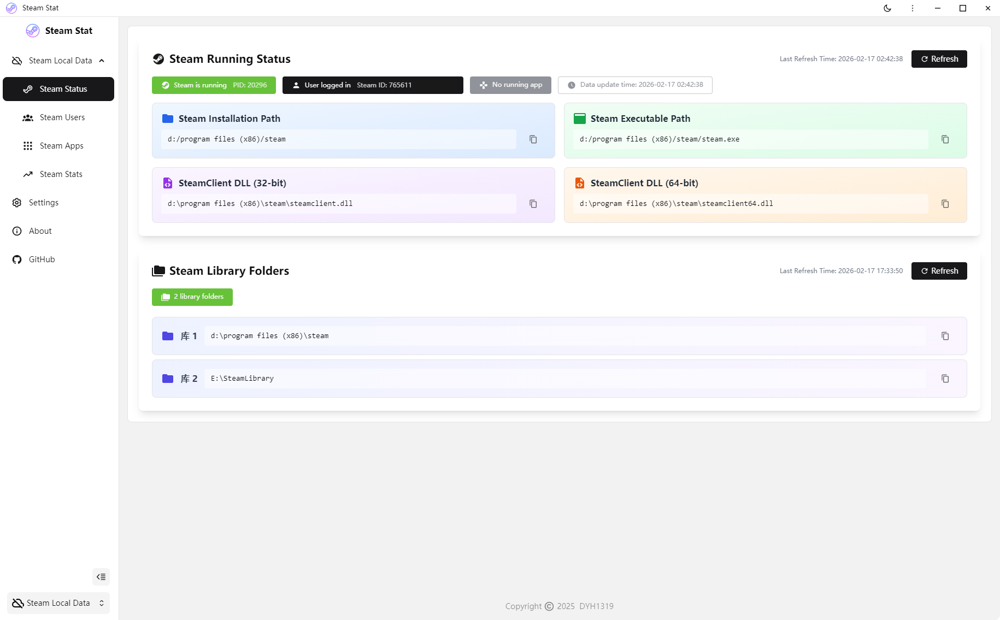
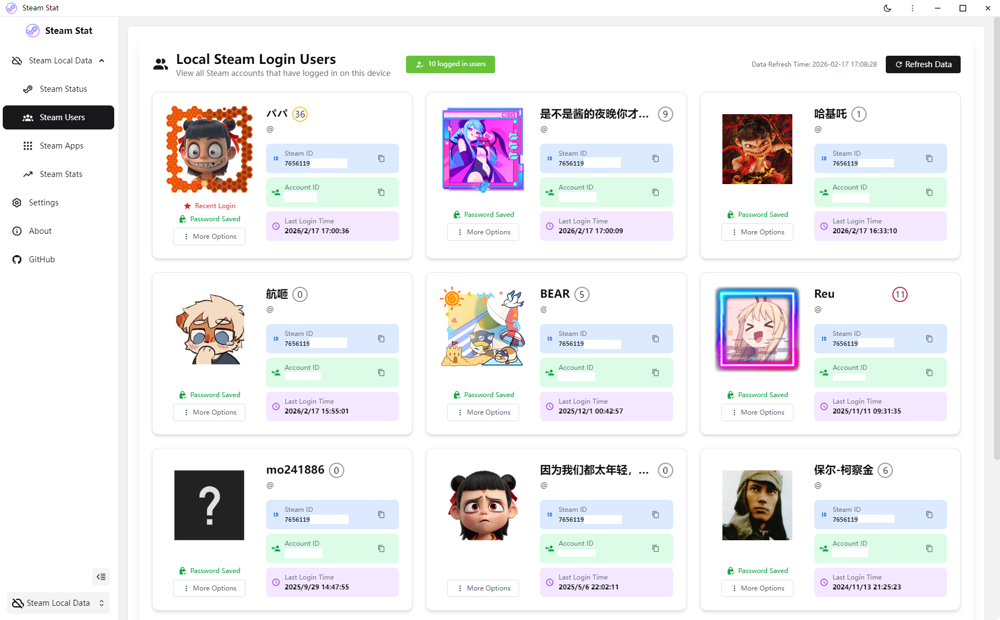
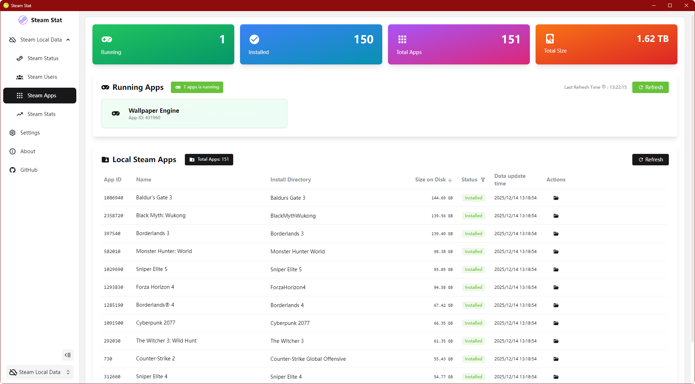
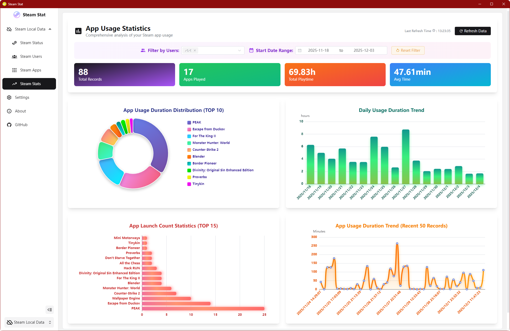

<p align="center">
  
</p>

<h1 align="center">Steam Stat</h1>

<p align="center"><b>Steam Game Statistics & Analytics Tool</b></p>

<p align="center">
  <a href="https://github.com/DYH1319/steam-stat/blob/master/LICENSE" target="_blank"></a>
  <a href="https://github.com/DYH1319/steam-stat/actions/workflows/build-and-release.yml" target="_blank"></a>
  <a href="https://github.com/DYH1319/steam-stat/releases" target="_blank"></a>
  <a href="https://github.com/DYH1319/steam-stat/releases" target="_blank"></a>
</p>

---

## 🌍 Languages | 语言

**[简体中文](README.md)** | **English (Current)**

---

## 📖 Introduction

**Steam Stat** is a Windows desktop application designed specifically for Steam users to help players gain deep insights into their Steam game library and playtime statistics. Through local data analysis and visual charts, you can clearly view game usage patterns, playtime trends, and account statistics.

### ✨ Why Choose Steam Stat?

- 🔒 **Privacy First**: All data is stored locally and never uploaded to any server
- 📊 **Data Visualization**: Provides intuitive charts and statistical analysis using ECharts
- ⚡ **High Performance**: Built on Electron and Vue 3 for fast responses
- 🎨 **Modern UI**: Uses Element Plus and UnoCSS for a beautiful and user-friendly interface
- 🔄 **Real-time Monitoring**: Automatically detects game running status and records playtime in real-time

---

## 📦 Installation & Usage

### Download and Install

1. Go to the [Releases](https://github.com/DYH1319/steam-stat/releases) page
2. Download the latest `Steam-Stat-Setup-x.x.x.exe` installer
3. Run the installer and follow the prompts to complete installation
4. Launch Steam Stat and start using it

### System Requirements

- **Operating System**: Windows 10 / 11 (64-bit)
- **Steam**: Steam client must be installed

---

## 🚀 Main Features

- ✅ **Steam Status**
  - Display local Steam running status
  - Show local Steam library directories
  - Display logged-in Steam users

- ✅ **Steam User Information**
  - Display information for Steam users logged in locally
  - Show user **SteamID** and **AccountID**
  - Display user **account name** and **persona name**

- ✅ **Steam App Information**
  - Automatically scan and sync local Steam app library
  - Display detailed app information (name, installation path, disk usage, etc.)
  - Support multiple Steam library folders
  - Show currently running Steam apps

- ✅ **Steam Usage Statistics**
  - Record Steam app running duration in real-time
  - Support statistics by playing user
  - Support statistics by playing time period
  - Display **Steam app playtime distribution** using ECharts
  - Display **Steam app daily playtime** using ECharts
  - Display **Steam app launch frequency statistics** using ECharts
  - Display **Steam app playtime trends** using ECharts

- ✅ **Automatic Data Collection**
  - Automatically detect Steam app running status
  - Automatically record Steam app running duration
  - Freely configure whether to enable automatic data collection and collection interval

- ✅ **Local Data Storage**
  - Use SQLite database for persistent data storage
  - Drizzle ORM provides type-safe data access
  - Automatic database structure migration and version management

- ✅ **Multi-language Support**
  - Simplified Chinese interface
  - English interface

- ✅ **Auto Update**
  - Integrated electron-updater
  - Support automatic updates from GitHub Releases

---

## 🎯 Future Plans

Only represents current plans, not guaranteed to be implemented, will be adjusted based on demand.

If you have good suggestions, feel free to submit them in [Issues](https://github.com/DYH1319/steam-stat/issues).

- [ ] **More Comprehensive Statistics**
  - Add more dimensional statistics to Steam usage statistics interface

- [ ] **Cross-platform Support**
  - macOS version
  - Linux version

- [ ] **Add More Data Sources**
  - Current data sources are all local
  - Consider adding Steam Web API as data source
  - Users can switch data sources
  - Users can choose whether to log in for more detailed data (all data stored locally only)

- [ ] **Steam Friends Statistics (requires more data sources)**
  - View friends' game time
  - Compare game libraries with friends
  - Recommend games based on shared ownership

- [ ] **Achievement Features (requires more data sources)**
  - Game achievement completion statistics
  - Achievement unlock timeline
  - Rare achievement display
  - Compare achievements with friends

- [ ] **Game Tags and Categories (requires more data sources)**
  - Custom game tags
  - Filter by type, publisher, etc.
  - Favorites feature

---

## 📸 Screenshots

<div align="center">

### Steam Status


### Steam User Information


### Steam App Information


### Steam Usage Statistics


</div>

---

## 🛠️ Technology Stack

### Core Frameworks
- **[Electron 32](https://www.electronjs.org/)** - Cross-platform desktop application framework
- **[Vue 3](https://vuejs.org/)** - Progressive JavaScript framework
- **[Vite](https://vitejs.dev/)** - Next generation frontend build tool
- **[Fantastic Admin Basic](https://fantastic-admin.hurui.me/)** - A Vue 3 based frontend system framework

### UI Frameworks & Styling
- **[Element Plus](https://element-plus.org/)** - Vue 3 based component library
- **[UnoCSS](https://unocss.dev/)** - Instant on-demand atomic CSS engine
- **[ECharts](https://echarts.apache.org/)** - Data visualization chart library
- **[Iconify](https://iconify.design/)** - Modern icon library
- **[Icon8](https://icon8.com/)** - Modern icon library, icons used in the project can NOT be redistributed.

### Data Storage
- **[Better-SQLite3](https://github.com/WiseLibs/better-sqlite3)** - Synchronous SQLite database
- **[Drizzle ORM](https://orm.drizzle.team/)** - Type-safe ORM

### Utility Libraries
- **[Pinia](https://pinia.vuejs.org/)** - Vue 3 state management
- **[VueUse](https://vueuse.org/)** - Collection of Vue Composition API utilities
- **[Day.js](https://day.js.org/)** - Lightweight time processing library

### Steam Related
- **[SteamKit](https://github.com/SteamRE/SteamKit)** - C# Steam client API (not currently used in this version)
- **[steam-session](https://github.com/DoctorMcKay/node-steam-session)** - Steam session management (not currently used in this version)
- **[steam-user](https://github.com/DoctorMcKay/node-steam-user)** - Steam user data (not currently used in this version)
- **[kvparser](https://github.com/DoctorMcKay/node-kvparser)** - VDF file parser

### Development Tools
- **[TypeScript](https://www.typescriptlang.org/)** - JavaScript superset
- **[ESLint](https://eslint.org/)** - Code linting tool
- **[Stylelint](https://stylelint.io/)** - CSS code linting tool
- **[electron-builder](https://www.electron.build/)** - Electron app packaging tool

---

## 🔧 Development Guide

### Environment Setup

Make sure the following tools are installed:

- [Node.js](https://nodejs.org/) >= 22.21.1
- [pnpm](https://pnpm.io/) >= 10.18.1

### Clone Repository

```bash
git clone https://github.com/DYH1319/steam-stat.git
cd steam-stat
```

### Install Dependencies

```bash
pnpm install
```

### Rebuild Native Modules

```bash
pnpm run rebuild
```

### Development Mode

```bash
pnpm dev
```

### Build Application

```bash
# Build Windows version
pnpm run build:win

# Build and generate versioned release package
pnpm run build:win:versioned
```

### Database Management

```bash
# Generate database migration files
pnpm run db:generate

# Execute database migration
pnpm run db:migrate

# Open Drizzle Studio (database visualization tool)
pnpm run db:studio
```

---

## 🤝 Contributing

Welcome to submit Issues and Pull Requests!

### Submit Issue

- 🐛 **Bug Report**: Please describe the steps to reproduce the problem in detail
- 💡 **Feature Request**: Please explain the use case and expected outcome
- ❓ **Help Wanted**: Please check documentation and existing Issues first

### Submit Pull Request

1. Fork this repository
2. Create branch (`git checkout -b feature/AmazingFeature`)
3. Commit changes (`git commit -m 'Add some AmazingFeature'`)
4. Push to branch (`git push origin feature/AmazingFeature`)
5. Open a Pull Request

### Development Standards

- Follow [Conventional Commits](https://www.conventionalcommits.org/) specification
- Write type-safe code using TypeScript
- Pass all ESLint and TypeScript checks
- Write comments and documentation for new features

---

## 📄 License

This project is licensed under the **MIT License**.

This means:

- ✅ You are free to use, modify, and distribute this software
- ✅ You can use this software for commercial purposes
- ✅ You can use this software for private purposes
- ⚠️ You must retain the original author's copyright notice and license notice

For details, please see the [LICENSE](LICENSE) file.

### Copyright Notice

```
MIT License

Copyright (c) 2025-2026 DYH1319
```

---

## 🙏 Acknowledgments

Thanks to the following projects and communities:

- [Electron](https://www.electronjs.org/) - Powerful cross-platform desktop application framework
- [Vue.js](https://vuejs.org/) - Elegant progressive framework
- [Fantastic Admin Basic](https://fantastic-admin.hurui.me/) - A Vue 3 based frontend system framework
- [Element Plus](https://element-plus.org/) - Beautiful Vue 3 component library
- [ECharts](https://echarts.apache.org/) - Professional data visualization library
- [Drizzle ORM](https://orm.drizzle.team/) - Modern TypeScript ORM
- [Icon8](https://icon8.com/) - Modern icon library, icons used in the project can NOT be redistributed.
- All developers who have contributed to this project

---

## 📬 Contact

- **Author**: DYH1319
- **GitHub**: [@DYH1319](https://github.com/DYH1319)
- **Issues**: [Submit Bug / Suggest Feature](https://github.com/DYH1319/steam-stat/issues)
- **Email**: [dyh@dyh1319.asia](mailto:dyh@dyh1319.asia)
- **A few words**: This is my first open source project. The original intention was to record my daily Steam usage and better manage my game time. My technical skills are limited, so bugs are inevitable. I welcome criticism and correction from all experts. I also welcome improvement suggestions from everyone to improve this project together ❤️

---

## ⭐ Star History

If this project helps you, please give it a Star ⭐️!

<a href="https://www.star-history.com/#DYH1319/steam-stat&type=date&legend=top-left">
 <picture>
   <source media="(prefers-color-scheme: dark)" srcset="https://api.star-history.com/svg?repos=DYH1319/steam-stat&type=date&theme=dark&legend=top-left" />
   <source media="(prefers-color-scheme: light)" srcset="https://api.star-history.com/svg?repos=DYH1319/steam-stat&type=date&legend=top-left" />
   
 </picture>
</a>

---

<div align="center">

Made with ❤️ by DYH1319

</div>
