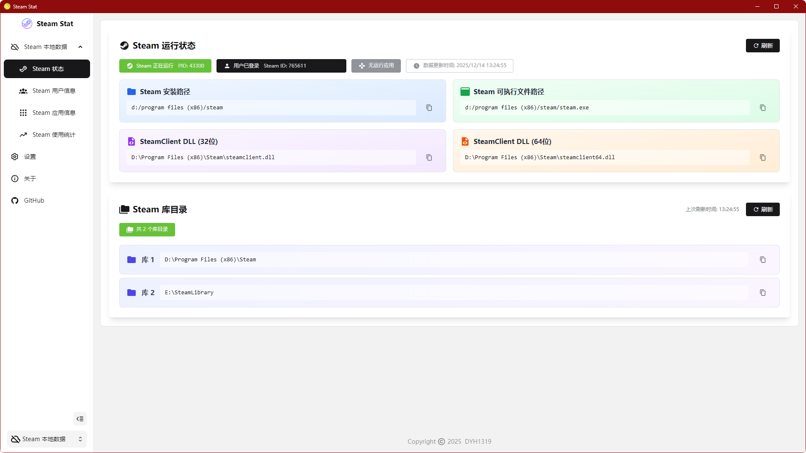
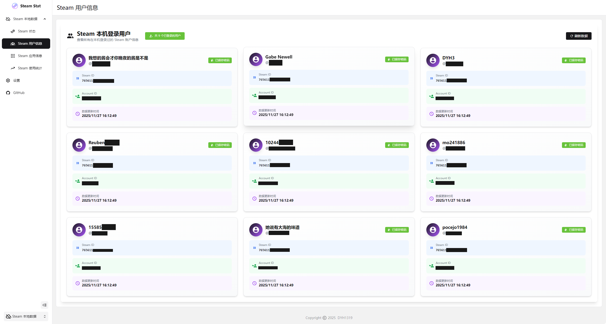
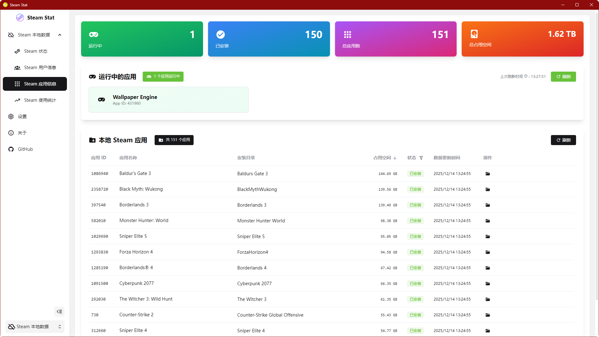
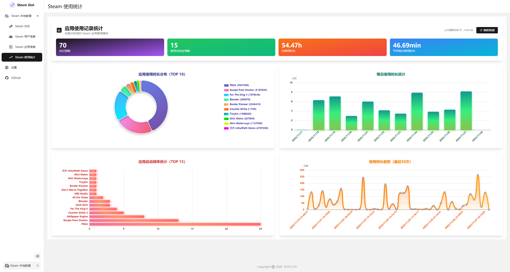

<p align="center">
  
</p>

<h1 align="center">Steam Stat</h1>

<p align="center"><b>Steam 游戏统计分析工具 | Steam Game Statistics & Analytics Tool</b></p>

<p align="center">
  <a href="https://github.com/DYH1319/steam-stat/blob/master/LICENSE" target="_blank"></a>
  <a href="https://github.com/DYH1319/steam-stat/actions/workflows/build-and-release.yml" target="_blank"></a>
  <a href="https://github.com/DYH1319/steam-stat/releases" target="_blank"></a>
  <a href="https://github.com/DYH1319/steam-stat/releases" target="_blank"></a>
</p>

---

## 🌍 语言 | Languages

**简体中文 (当前)** | **[English](README.en-US.md)**

---

## 📖 项目简介

**Steam Stat** 是一款专为 Steam 用户设计的 Windows 桌面应用程序，旨在帮助玩家深入了解自己的 Steam 游戏库和游戏时间统计。通过本地数据分析和可视化图表，您可以清晰地查看游戏使用情况、游戏时长趋势、以及账户统计信息。

### ✨ 为什么选择 Steam Stat？

- 🔒 **隐私优先**：所有数据均存储在本地，不会上传到任何服务器
- 📊 **数据可视化**：使用 ECharts 提供直观的图表和统计分析
- ⚡ **高性能**：基于 Electron 和 Vue 3 构建，响应迅速
- 🎨 **现代 UI**：采用 Element Plus 和 UnoCSS，界面美观易用
- 🔄 **实时监控**：自动检测游戏运行状态，实时记录游戏时长

---

## 📦 安装与使用

### 下载安装

1. 前往 [Releases](https://github.com/DYH1319/steam-stat/releases) 页面
2. 下载最新版本的 `Steam-Stat-Setup-x.x.x.exe` 安装包
3. 运行安装程序，按照提示完成安装
4. 启动 Steam Stat，开始使用

### 系统要求

- **操作系统**：Windows 10 / 11 (64-bit)
- **Steam**：需要安装 Steam 客户端

---

## 🚀 主要功能

- ✅ **Steam 状态**
  - 显示本地 Steam 运行状态
  - 显示本地 Steam 库目录
  - 显示登录的 Steam 用户

- ✅ **Steam 用户信息**
  - 显示在本地登陆过的 Steam 用户信息
  - 显示 Steam 用户的 **SteamID** 和 **AccountID**
  - 显示 Steam 用户的 **账号** 和 **昵称**

- ✅ **Steam 应用信息**
  - 自动扫描和同步本地 Steam 应用库
  - 显示应用详细信息（名称、安装路径、磁盘占用等）
  - 支持多个 Steam 库文件夹
  - 显示当前正在运行的 Steam 应用

- ✅ **Steam 使用统计**
  - 实时记录 Steam 应用运行时长
  - 支持按照游玩的用户进行统计
  - 支持按照游玩的时间段进行统计
  - 使用 ECharts 展示 **Steam 应用使用时长分布**
  - 使用 ECharts 展示 **Steam 应用每日使用时长**
  - 使用 ECharts 展示 **Steam 应用启动频率统计**
  - 使用 ECharts 展示 **Steam 应用使用时长趋势**

- ✅ **自动数据采集**
  - 自动检测 Steam 应用运行状态
  - 自动记录 Steam 应用运行时长
  - 可以自由设置是否自动采集数据以及数据采集间隔

- ✅ **本地数据存储**
  - 使用 SQLite 数据库持久化存储数据
  - Drizzle ORM 提供类型安全的数据访问
  - 自动数据库结构迁移和版本管理

- ✅ **多语言支持**
  - 简体中文界面
  - 英语界面

- ✅ **自动更新**
  - 集成 electron-updater
  - 支持从 GitHub Releases 自动更新

---

## 🎯 未来计划

只代表目前的计划，不保证都会实现，会根据需求进行增减。

如果有好的建议，欢迎在 [Issues](https://github.com/DYH1319/steam-stat/issues) 中提出。

- [ ] **更加完善的统计信息**
  - 在 Steam 使用统计界面添加更多维度的统计信息

- [ ] **跨平台支持**
  - macOS 版本
  - Linux 版本

- [ ] **添加更多的数据来源**
  - 目前的数据来源均来自于本地
  - 未来会考虑添加 Steam Web API 等的数据来源
  - 用户可以自行切换数据来源
  - 用户可以选择是否进行登录来获取更详细的数据（所有数据均只会存储在本地）

- [ ] **Steam 好友统计（需要基于更多的数据来源）**
  - 查看好友游戏时长
  - 好友游戏库对比
  - 共同游戏推荐

- [ ] **成就功能（需要基于更多的数据来源）**
  - 游戏成就完成度统计
  - 成就解锁时间线
  - 稀有成就展示
  - 与好友对比成就

- [ ] **游戏标签和分类（需要基于更多的数据来源）**
  - 自定义游戏标签
  - 按类型、发行商等筛选
  - 收藏夹功能

---

## 📸 项目预览

<div align="center">

### Steam 状态


### Steam 用户信息


### Steam 应用信息


### Steam 使用统计


</div>

---

## 🛠️ 技术栈

### 核心框架
- **[Electron 32](https://www.electronjs.org/)** - 跨平台桌面应用框架
- **[Vue 3](https://vuejs.org/)** - 渐进式 JavaScript 框架
- **[Vite](https://vitejs.dev/)** - 下一代前端构建工具
- **[Fantastic Admin 基础版](https://fantastic-admin.hurui.me/)** - 一款基于 Vue 3 的前端系统框架

### UI 框架与样式
- **[Element Plus](https://element-plus.org/)** - 基于 Vue 3 的组件库
- **[UnoCSS](https://unocss.dev/)** - 即时原子化 CSS 引擎
- **[ECharts](https://echarts.apache.org/)** - 数据可视化图表库
- **[Iconify](https://iconify.design/)** - Iconify 现代图标库
- **[Icon8](https://icon8.com/)** - Icon8 现代图标库，项目中使用的图标不能进行二次分发，icons can NOT be redistributed.

### 数据存储
- **[Better-SQLite3](https://github.com/WiseLibs/better-sqlite3)** - 同步 SQLite 数据库
- **[Drizzle ORM](https://orm.drizzle.team/)** - 类型安全的 ORM

### 工具库
- **[Pinia](https://pinia.vuejs.org/)** - Vue 3 状态管理
- **[VueUse](https://vueuse.org/)** - Vue 组合式 API 工具集
- **[Day.js](https://day.js.org/)** - 轻量级时间处理库

### Steam 相关
- **[SteamKit](https://github.com/SteamRE/SteamKit)** - C# Steam 客户端 API（目前版本暂未实际使用）
- **[steam-session](https://github.com/DoctorMcKay/node-steam-session)** - Steam 会话管理（目前版本暂未实际使用）
- **[steam-user](https://github.com/DoctorMcKay/node-steam-user)** - Steam 用户数据（目前版本暂未实际使用）
- **[kvparser](https://github.com/DoctorMcKay/node-kvparser)** - VDF 文件解析器

### 开发工具
- **[TypeScript](https://www.typescriptlang.org/)** - JavaScript 的超集
- **[ESLint](https://eslint.org/)** - 代码检查工具
- **[Stylelint](https://stylelint.io/)** - CSS 代码检查工具
- **[electron-builder](https://www.electron.build/)** - Electron 应用打包工具

---

## 🔧 开发指南

### 环境准备

确保已安装以下工具：

- [Node.js](https://nodejs.org/) >= 22.21.1
- [pnpm](https://pnpm.io/) >= 10.18.1

### 克隆项目

```bash
git clone https://github.com/DYH1319/steam-stat.git
cd steam-stat
```

### 安装依赖

```bash
pnpm install
```

### 重建原生模块

```bash
pnpm run rebuild
```

### 开发模式

```bash
pnpm dev
```

### 构建应用

```bash
# 构建 Windows 版本
pnpm run build:win

# 构建并生成带版本号的发布包
pnpm run build:win:versioned
```

### 数据库管理

```bash
# 生成数据库迁移文件
pnpm run db:generate

# 执行数据库迁移
pnpm run db:migrate

# 打开 Drizzle Studio（数据库可视化工具）
pnpm run db:studio
```

---

## 🤝 贡献指南

欢迎提交 Issue 和 Pull Request！

### 提交 Issue

- 🐛 **Bug 反馈**：请详细描述问题复现步骤
- 💡 **功能建议**：请说明功能的使用场景和期望效果
- ❓ **问题求助**：请先查看文档和已有 Issue

### 提交 Pull Request

1. Fork 本仓库
2. 创建分支 (`git checkout -b feature/AmazingFeature`)
3. 提交更改 (`git commit -m 'Add some AmazingFeature'`)
4. 推送到分支 (`git push origin feature/AmazingFeature`)
5. 开启 Pull Request

### 开发规范

- 遵循 [Conventional Commits](https://www.conventionalcommits.org/) 规范
- 使用 TypeScript 编写类型安全的代码
- 通过所有 ESLint 和 TypeScript 检查
- 为新功能编写注释和文档

---

## 📄 许可证

本项目采用 **MIT** 许可证。

这意味着：

- ✅ 您可以自由使用、修改和分发本软件
- ✅ 您可以将本软件用于商业目的
- ✅ 您可以将本软件用于私人用途
- ⚠️ 您必须保留原作者的版权声明和许可声明

详细信息请查看 [LICENSE](LICENSE) 文件。

### 版权声明

```
MIT License

Copyright (c) 2025-2026 DYH1319
```

---

## 🙏 致谢

感谢以下项目和社区：

- [Electron](https://www.electronjs.org/) - 强大的跨平台桌面应用框架
- [Vue.js](https://vuejs.org/) - 优雅的渐进式框架
- [Fantastic Admin 基础版](https://fantastic-admin.hurui.me/) - 一款基于 Vue 3 的前端系统框架
- [Element Plus](https://element-plus.org/) - 精美的 Vue 3 组件库
- [ECharts](https://echarts.apache.org/) - 专业的数据可视化库
- [Drizzle ORM](https://orm.drizzle.team/) - 现代化的 TypeScript ORM
- [Icon8](https://icon8.com/) - Icon8 现代图标库，项目中使用的图标不能进行二次分发，icons can NOT be redistributed.
- 所有为本项目做出贡献的开发者

---

## 📬 关于

- **作者**：DYH1319
- **GitHub**：[@DYH1319](https://github.com/DYH1319)
- **Issues**：[提交 BUG / 提出建议](https://github.com/DYH1319/steam-stat/issues)
- **Email**：[dyh@dyh1319.asia](mailto:dyh@dyh1319.asia)
- **一些想说的话**：这是我的第一个开源项目，初衷是想记录自己的每天使用 Steam 的情况，更好的管理自己的游戏时间；本人技术有限，难免有 Bug，欢迎各位大佬批评指正；也欢迎各位大佬提出改进建议，一起完善这个项目 ❤️

---

## ⭐ Star History

如果这个项目对您有帮助，请给个 Star ⭐️ 支持一下！

<a href="https://www.star-history.com/#DYH1319/steam-stat&type=date&legend=top-left">
 <picture>
   <source media="(prefers-color-scheme: dark)" srcset="https://api.star-history.com/svg?repos=DYH1319/steam-stat&type=date&theme=dark&legend=top-left" />
   <source media="(prefers-color-scheme: light)" srcset="https://api.star-history.com/svg?repos=DYH1319/steam-stat&type=date&legend=top-left" />
   
 </picture>
</a>

---

<div align="center">

Made with ❤️ by DYH1319

</div>
