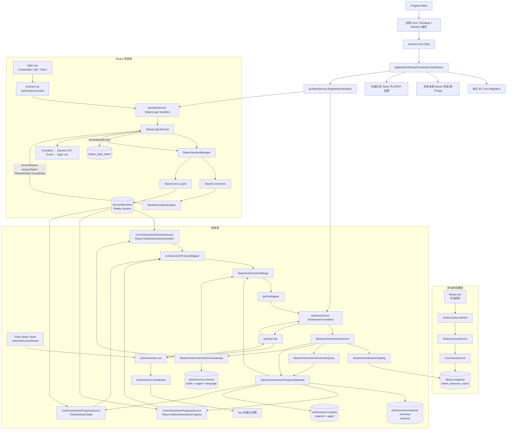
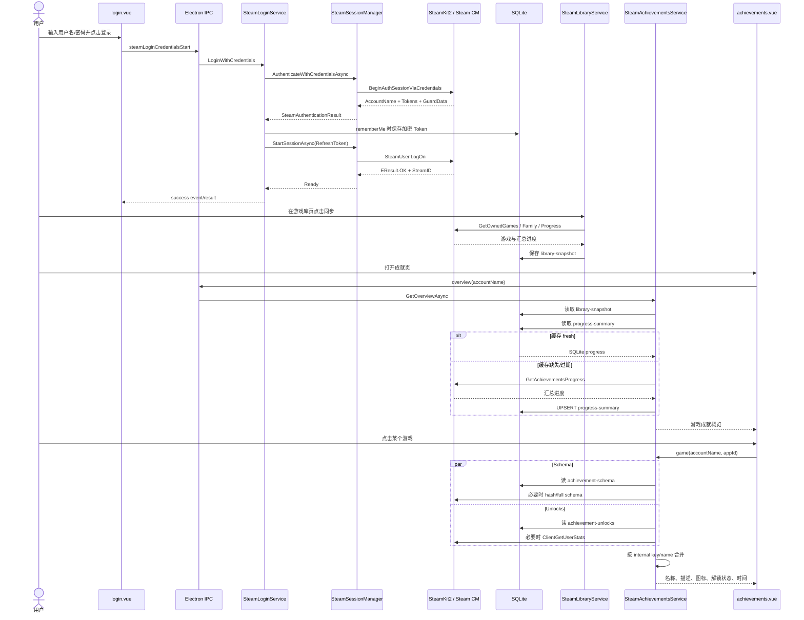

# Steam Achievement 系统源码学习指南

> 本文基于当前仓库中的实际源码、引用关系、依赖注入注册、IPC 合约和数据库映射整理。文档、注释或类名与代码行为冲突时，以当前代码行为为准。
>
> 当前进度：完成全仓库功能地图，并开始 Chapter 1 / Step 1。

## 0. 核心结论

### 【代码事实】

当前 Steam 成就系统的真实架构不是：

```text
Vue → REST Controller → Achievement Repository → Steam Web API
```

而是：

```text
Vue Renderer
  ↓ typed Electron IPC
Electron preload.mjs
  ↓ ipcRenderer.invoke
IpcMainService
  ↓
SteamAchievementsService
  ├─ SteamOwnedGameCatalog
  │    └─ SQLite 中的 library-snapshot
  ├─ SteamAchievementSchemaGateway
  │    ├─ SQLite 成就 Schema 缓存
  │    └─ SteamKit2 CM：Player.GetGameAchievements#1
  └─ SteamAchievementProgressGateway
       ├─ SQLite 账号进度缓存
       └─ SteamKit2 CM
            ├─ Player.GetAchievementsProgress
            └─ EMsg.ClientGetUserStats
```

### 特别重要的事实

1. **成就不是通过 Steam Web API 获取的。**
   - 当前使用 SteamKit2 登录后的 Steam CM 会话。
   - Schema 调用 `Player.GetGameAchievements#1`。
   - 概览进度调用 `Player.GetAchievementsProgress`。
   - 单游戏解锁详情调用 `EMsg.ClientGetUserStats`。
   - `api.steampowered.com` named HTTP client 存在，但目前主要用于 Wishlist，不参与成就获取。

2. **没有 REST Controller，也没有 HTTP API。**
   - 前后端边界是 Electron IPC。
   - 后端入口集中在 `IpcMainService.RegisterIpcHandlers()`。

3. **没有独立的 Achievement 数据表。**
   - Schema、汇总进度、单游戏解锁数据都序列化成 JSON，存入统一的 `steam_resource_cache` 表。
   - 没有 `AchievementEntity`、`AchievementRepository` 或成就外键关系。

4. **程序重启后不会自动恢复 SteamKit 登录会话。**
   - Refresh Token 会被加密并持久化。
   - 启动代码不会自动调用 `LoginWithToken()`。
   - 用户必须在登录页点击保存 Token 的登录按钮。

5. **当前没有后台自动同步成就。**
   - 没有 Achievement Worker、BackgroundService、Scheduler 或定时刷新任务。
   - 成就请求只由页面打开、切换账号、点击游戏和手动刷新触发。

6. **成就页依赖已经持久化的 Steam 游戏库快照。**
   - 成就服务不会主动刷新游戏库。
   - 如果该账号尚未在游戏库页面执行过同步，成就概览可能返回空列表。
   - 单游戏详情还会先验证 AppId 是否存在于缓存的游戏库中。

7. **“刷新成就概览”不是真正的强制刷新。**
   - 前端只是再次调用 `steamAchievementsOverviewGet`。
   - 后端仍使用 `SteamRefreshMode.PreferCache`。
   - 如果 15 分钟的汇总缓存仍是 fresh，就不会访问 Steam。
   - 只有“刷新单游戏详情”调用 `RefreshGameAsync()`，使用 `RequireRefresh`。

---

# 1. Steam Achievement 功能地图

## 1.1 分层地图

```text
┌─────────────────────────────────────────────────────────────┐
│ Vue Renderer                                                │
│                                                             │
│ login.vue                                                   │
│   ├─ 用户名密码登录                                         │
│   ├─ QR 登录                                                │
│   └─ 手动使用保存 Token 登录                                │
│                                                             │
│ steam Pinia Store                                           │
│   ├─ loggedInAccounts                                       │
│   └─ selectedAccountName                                    │
│                                                             │
│ achievements.vue                                            │
│   ├─ 读取账号成就概览                                       │
│   ├─ 点击游戏读取详情                                       │
│   └─ 手动强制刷新单游戏                                     │
└──────────────────────────┬──────────────────────────────────┘
                           │ window.electron.*
                           ▼
┌─────────────────────────────────────────────────────────────┐
│ Electron preload.mjs                                        │
│                                                             │
│ ipcRenderer.invoke("steamLogin:*")                          │
│ ipcRenderer.invoke("steamAchievements:*")                   │
└──────────────────────────┬──────────────────────────────────┘
                           │ Electron IPC
                           ▼
┌─────────────────────────────────────────────────────────────┐
│ Electron Host                                               │
│                                                             │
│ IpcMainService.RegisterIpcHandlers()                         │
│   ├─ SteamLoginService                                      │
│   └─ SteamAchievementsService                               │
│                                                             │
│ IpcDtoMapper                                                │
│   Core Model → IPC DTO → renderer JSON                       │
└─────────────┬────────────────────────────┬──────────────────┘
              │                            │
              ▼                            ▼
┌──────────────────────────┐   ┌──────────────────────────────┐
│ Steam 登录/Session       │   │ Achievement Application Flow │
│                          │   │                              │
│ SteamLoginService        │   │ SteamAchievementsService     │
│   ↓                      │   │   ├─ OwnedGameCatalog        │
│ SteamSessionManager      │   │   ├─ SchemaGateway          │
│   ↓                      │   │   └─ ProgressGateway        │
│ SteamConnection          │   └──────────────┬───────────────┘
│   ↓ SteamKit2            │                  │
│ Steam CM                 │                  ▼
└───────────┬──────────────┘   ┌──────────────────────────────┐
            │                  │ 通用 SQLite Cache            │
            │                  │ steam_resource_cache         │
            │                  │                              │
            │                  │ library-snapshot             │
            │                  │ achievement-schema           │
            │                  │ achievement-progress-summary │
            │                  │ achievement-unlocks          │
            │                  └──────────────────────────────┘
            ▼
┌─────────────────────────────────────────────────────────────┐
│ Steam CM                                                    │
│                                                             │
│ Authentication.BeginAuthSessionViaCredentialsAsync          │
│ Authentication.BeginAuthSessionViaQRAsync                   │
│ SteamUser.LogOn                                             │
│ Player.GetGameAchievements#1                                │
│ Player.GetAchievementsProgress                              │
│ EMsg.ClientGetUserStats                                     │
└─────────────────────────────────────────────────────────────┘
```

## 1.2 登录、Session、账号之间的区别

### A. 本地 Steam 用户

来源：

```text
Steam 安装目录/config/loginusers.vdf
```

由 `SteamUserService` 读取并写入 `SteamUserTable`。它表示“这个 Windows 机器上的 Steam 客户端曾经登录过哪些用户”，并不等于当前 SteamKit 会话。

### B. SteamKit 登录账号

由 `SteamSessionManager` 的 `_accounts` 字典维护：

```csharp
ConcurrentDictionary<string, AccountRuntime>
```

key 是 `accountName`，例如 Steam 登录用户名。它表示 Steam Stat 当前进程中已经连接并完成 SteamKit LogOn 的账号。只有处于 `Ready` 状态的账号，才能请求个人成就进度。

源码：`backend/src/SteamStat.Core/Steam/Session/SteamSessionManager.cs:20-29`

### C. 当前活跃的本地 Steam 用户

`GlobalStatus.ActiveUserSteamId` 来自本地 Steam 进程/注册表状态，主要用于游戏运行记录，并不决定成就页面选中了哪个 SteamKit 账号。

### D. 成就页面当前账号

由 Pinia 中的 `selectedAccountName` 决定。第一次获得登录账号列表时，默认选择列表中的第一个账号：

```ts
if (!selectedAccountName.value || !loggedInAccounts.value.includes(selectedAccountName.value)) {
  selectedAccountName.value = loggedInAccounts.value[0] ?? null
}
```

源码：`src/store/modules/steam.ts:19-22`

所以当前存在两套“当前账号”概念：

```text
本地 Steam 客户端当前用户
    = GlobalStatus.ActiveUserSteamId

成就页面当前选择
    = Pinia selectedAccountName
```

二者当前没有自动绑定。

---

# 2. 涉及的主要文件

## 2.1 程序启动与依赖注入

### `ElectronNet/ElectronNet/Program.cs`

进入调用链的原因：

- 创建 Generic Host。
- 注册 Core、Windows、Electron 三层服务。
- 启动 Hosted Service。
- 调用 `ApplicationStartupCoordinator.StartAsync()`。

关键位置：`Program.cs:109-124`。

### `ElectronNet/ElectronNet/Hosting/ApplicationStartupCoordinator.cs`

进入调用链的原因：

- 执行数据库 migration。
- 初始化本地 Steam 状态、用户和 App。
- 加密历史明文 Token。
- 创建窗口并注册 IPC。
- **没有恢复 SteamKit Session。**

关键位置：`ApplicationStartupCoordinator.cs:25-59`。

### `backend/src/SteamStat.Core/DependencyInjection/SteamStatCoreServiceCollectionExtensions.cs`

进入调用链的原因：

- 注册 SessionManager、登录服务、成就 Gateway、缓存并发合并器和 CM Scheduler。
- 这些服务全部是 Singleton。

主要关系：

```text
ISteamSessionManager
  → SteamSessionManager
  → Singleton

ISteamAchievementSchemaGateway
  → SteamAchievementSchemaGateway
  → Singleton

ISteamAchievementProgressGateway
  → SteamAchievementProgressGateway
  → Singleton

SteamAchievementsService
  → concrete Singleton
```

关键位置：`SteamStatCoreServiceCollectionExtensions.cs:39-87`。

### `ElectronNet/ElectronNet/DependencyInjection/SteamStatElectronServiceCollectionExtensions.cs`

进入调用链的原因：

- 注册 EF `IDbContextFactory`。
- 将通用缓存端口映射到 EF 实现。
- 注册 Token Store、语言 Provider 和 IPC Main Service。

关键位置：`SteamStatElectronServiceCollectionExtensions.cs:31-82`。

## 2.2 登录 UI 与 IPC

### `src/views/steam/login.vue`

真正的用户登录入口，提供用户名密码、QR、保存 Token 三种登录方式，并监听后端登录进度事件。

关键入口：

- `handleCredentialsLogin()`：约 225 行。
- `handleQrLogin()`：约 251 行。
- `handleTokenLogin()`：约 352 行。
- `onLoginEvent()`：约 89 行。

### `src/composables/useIpc.ts`

取得 `window.electron`，并给 IPC 方法统一做异常规范化。它不是 HTTP client。

### `ElectronNet/ElectronNet/Resources/preload.mjs`

Electron renderer 到 host 的安全桥。将有限的 typed 方法暴露为 `window.electron`，最终调用 `ipcRenderer.invoke()`。

```js
steamLoginCredentialsStart: param =>
  ipcRenderer.invoke('steamLogin:credentials:start', param)

steamAchievementsGameGet: param =>
  ipcRenderer.invoke('steamAchievements:game:get', param)
```

### `backend/src/SteamStat.Contracts/IpcContracts.cs`

channel 名、JavaScript API method、请求和响应类型的唯一声明源。preload 和 TypeScript 声明由它生成。

### `backend/src/SteamStat.Contracts/IpcDtos.cs`

定义 IPC 边界上的登录、账号、游戏和成就 DTO。成就游戏请求明确包含 `AccountName + AppId`。

### `ElectronNet/ElectronNet/Services/IpcMainService.cs`

后端真正的 IPC Endpoint，相当于本项目中的 Controller。登录入口约 82–102 行，成就入口约 128–133 行。

## 2.3 Authentication 与 Session

### `backend/src/SteamStat.Core/Features/Login/SteamLoginService.cs`

- 编排三种登录方式。
- 管理一次登录操作的取消和互斥。
- 保存 Token。
- 将登录进度通过 EventBus 发给前端。
- 登录认证成功后继续启动正式 Steam Session。

### `backend/src/SteamStat.Core/Steam/Session/Internal/SteamConnection.cs`

- 真正直接调用 SteamKit2。
- 创建 `SteamClient` 和 callback pump。
- 调用 Steam Authentication API。
- 使用 Refresh Token 执行 `SteamUser.LogOn()`。
- 注册成就用户统计协议 Handler。

### `backend/src/SteamStat.Core/Steam/Session/SteamSessionManager.cs`

- 多账号 Steam Session 的实际拥有者。
- 每个账号一个 `AccountRuntime`。
- 管理状态机、generation、断线、重连和退出。
- 为成就 Gateway 提供当前 `SteamClient`。

### `backend/src/SteamStat.Core/Steam/Session/SteamSessionState.cs`

真实 Session 状态：

```text
Disconnected
Connecting
Authenticating
Ready
ReconnectWaiting
Reconnecting
ReauthenticationRequired
Failed
Stopping
```

### `backend/src/SteamStat.Core/Steam/Session/SteamReconnectPolicy.cs`

- 最多重连 10 次。
- 指数退避，5 秒到 1 分钟。
- Rate Limit 后基础等待 2 分钟。
- 终止性认证错误转入 `ReauthenticationRequired`。

## 2.4 凭据持久化

### `backend/src/SteamStat.Core/Features/Login/SteamCredentialStore.cs`

- 将 Refresh Token 和 GuardData 保存在内存或数据库。
- 使用 `ISecretStore` 加密和解密。
- 内存字典用于当前进程中的断线重连。
- 数据库 Token 用于用户手动恢复登录。

### `ElectronNet/ElectronNet/Features/Login/Persistence/SteamLoginTokenStore.cs`

`ISteamLoginTokenStore` 的 EF Core 实现，对 `steam_login_token` 执行查询、upsert 和删除。

### `ElectronNet/ElectronNet/Features/Login/Persistence/SteamLoginTokenConfiguration.cs`

配置 `steam_login_token` 表。`account_name` 有唯一索引，保存 AccessToken、RefreshToken 和 GuardData。

## 2.5 成就前端

### `src/views/steam/achievements.vue`

- 账号变化后加载概览。
- 用户点击游戏后加载单游戏详情。
- 手动刷新单游戏时调用强制刷新 Endpoint。

```text
watch(selectedAccountName)
  → overview.execute()

openGame(appId)
  → detail.execute(accountName, appId, false)

refreshDetail()
  → detail.execute(accountName, appId, true)
```

### `src/features/achievements/viewModel.ts`

- IPC DTO 到 Vue 展示模型的最后一层转换。
- 选择本地化名称。
- 根据解锁状态选择彩色或灰色图标。
- 把 Unix 秒转换成 `Date`。
- 过滤未 reveal 的隐藏成就。
- 限制图标 URL 只能来自 Steam CDN 白名单。

## 2.6 成就业务与 Steam 协议

### `backend/src/SteamStat.Core/Features/Achievements/SteamAchievementsService.cs`

- 检查游戏是否存在于账号的缓存游戏库。
- 并行获取 schema 和用户解锁进度。
- 最后合并结果。

### `backend/src/SteamStat.Core/Features/Achievements/SteamAchievementOverviewQuery.cs`

从游戏库得到 AppId 列表，批量请求各 App 的成就总数、解锁数和百分比，再合并成概览列表。

### `backend/src/SteamStat.Core/Steam/Gateway/SteamAchievementSchemaGateway.cs`

- 读取和刷新公共成就定义。
- 缓存按 AppId + Language 区分。
- 过期时先请求 hash；hash 没变就不下载完整 schema。
- Steam 失败时可返回旧缓存。

### `backend/src/SteamStat.Core/Steam/Gateway/Internal/CmAchievementSchemaSource.cs`

从 SessionManager 获取 SteamKit Session，并通过 `SteamUnifiedMessages` 发送真实 Steam CM 请求。

### `backend/src/SteamStat.Core/Steam/Gateway/Internal/AchievementSchemaProtocol.cs`

定义 Steam protobuf 请求、返回结构和方法名 `Player.GetGameAchievements#1`。响应包含内部名称、本地化名称、描述、图标、隐藏状态、全球解锁率、schema hash 和分组。

### `backend/src/SteamStat.Core/Steam/Gateway/SteamAchievementProgressGateway.cs`

- 管理账号成就汇总和单游戏解锁缓存。
- 缓存身份使用 SteamID64，不是 accountName。
- 验证 Session generation，防止旧 Session 的迟到响应污染新 Session。
- Steam 请求失败时尝试返回旧缓存。

### `backend/src/SteamStat.Core/Steam/Gateway/Internal/CmAchievementProgressSource.cs`

真实发出两类个人成就请求：

```text
Player.GetAchievementsProgress
EMsg.ClientGetUserStats
```

### `backend/src/SteamStat.Core/Steam/Gateway/Internal/AchievementProtocolMapper.cs`

- 把 Steam protobuf/KV 返回值转换成 Core Model。
- 验证重复 AppId、重复 internal name、百分比范围、时间戳等。
- 解码 `ClientGetUserStats` 中的 Binary KeyValues。

### `backend/src/SteamStat.Core/Features/Achievements/SteamAchievementMerge.cs`

将成就定义与解锁状态合并，优先按 `InternalKey` 匹配，否则按区分大小写的 `InternalName` 匹配。

## 2.7 数据库缓存

### `ElectronNet/ElectronNet/AppDbContext.cs`

声明统一缓存表：

```csharp
DbSet<SteamResourceCacheEntry> SteamResourceCacheTable
```

### `ElectronNet/ElectronNet/Features/SteamCache/Persistence/EfSteamResourceCacheStore.cs`

- 执行 SQLite 读取和 UPSERT。
- 使用完整复合 key。
- 限制 payload 最大 1 MiB。
- 使用单条 `INSERT ... ON CONFLICT DO UPDATE` 原子更新。

### `ElectronNet/ElectronNet/Features/SteamCache/Persistence/SteamResourceCacheConfiguration.cs`

缓存唯一键：

```text
ResourceKind
+ ScopeId
+ ResourceId
+ Language
+ Variant
+ SchemaVersion
```

### `backend/src/SteamStat.Core/Steam/Cache/SteamAchievementCacheKeys.cs`

定义三类成就缓存的具体 key。

### `backend/src/SteamStat.Core/Steam/Cache/SteamCachePolicy.cs`

定义 Fresh、Stale、Expired、Retain 的时间策略。

---

# 3. 完整调用链



---

# 4. 数据流

## 4.1 Steam Login

### 用户名密码登录

```text
username + password + rememberMe
    ↓
login.vue
    ↓ Electron IPC
SteamLoginService.LoginWithCredentials
    ↓
SteamSessionManager.AuthenticateWithCredentialsAsync
    ↓
SteamConnection
    ↓
SteamKit2.BeginAuthSessionViaCredentialsAsync
    ↓
Steam Guard / 手机确认
    ↓
SteamAuthenticationResult
    ├─ AccountName
    ├─ AccessToken
    ├─ RefreshToken
    └─ GuardData
    ↓
SteamCredentialStore
    ↓ rememberMe=true
DPAPI 加密
    ↓
steam_login_token
```

Authentication 完成后还没有结束：

```text
RefreshToken
    ↓
SteamSessionManager.StartSessionAsync
    ↓
SteamConnection.LogOnAsync
    ↓
SteamUser.LogOnDetails.AccessToken = refreshToken
    ↓
LoggedOnCallback EResult.OK
    ↓
AccountRuntime.Current = SteamConnection
    ↓
Session State = Ready
```

## 4.2 Token、Cookie、Session 和 SteamID

### Token

项目保存 Access Token、Refresh Token 和 GuardData。

当前代码中：

- **Refresh Token** 用于 `SteamUser.LogOn()` 和断线重连。
- **Access Token** 会持久化，但当前登录恢复路径没有使用它。

### Cookie

【代码事实】当前 Steam 登录与成就调用链中没有 Cookie 管理：

- 没有 CookieContainer。
- 没有 Steam Community Web Cookie。
- 没有把 SteamKit Session 转换成网页 Session。

### Session

Session 是内存中的 `SteamConnection`：

```text
SteamConnection
  ├─ SteamClient
  ├─ CallbackManager
  ├─ callback pump Task
  ├─ SteamID
  └─ Generation
```

程序退出后它不存在。

### SteamID

个人成就请求时从下列代码取得 SteamID64：

```csharp
session.Client.SteamID.ConvertToUInt64()
```

位置：`CmAchievementProgressSource.cs:44-54`。

数据库中的个人成就缓存使用 SteamID64 字符串作为 `scope_id`。

## 4.3 Steam Account 与多账号

```text
accountName
    ↓
SteamSessionManager._accounts[accountName]
    ↓
AccountRuntime
    ↓
SteamConnection
    ↓
SteamID64
```

前端只发送 `accountName`。后端通过账号名寻找 Session，再从实际 Session 读取可信 SteamID。缓存 key 最终绑定实际登录身份，而不是前端提交的 SteamID。

## 4.4 Steam Game / AppId

```text
Steam CM Library Response
    ↓
SteamLibrarySnapshot
    ↓
SteamOwnedGame
    ↓ JSON
steam_resource_cache / library-snapshot
    ↓
SteamOwnedGameCatalog.GetCachedAsync(accountName)
    ↓
OwnedGameCatalogItem.AppId
```

成就详情请求虽然接收前端 `appId`，但服务会先检查 AppId 是否存在于该账号的缓存游戏库：

```csharp
var game = games.FirstOrDefault(item => item.AppId == appId);
```

找不到就返回 `AppUnavailable`，不会直接向 Steam 查询任意 AppId。

位置：`SteamAchievementsService.cs:37-55`。

## 4.5 Achievement Schema

Schema 是公共数据：

```text
AppId + language
    ↓
SteamAchievementSchemaGateway
    ↓
cache key:
achievement-schema / public / appId / language / v1
    ↓
Fresh?
    ├─ 是 → 返回 SQLite
    └─ 否 → 请求 Steam schema hash
                ├─ hash 相同 → 延长缓存有效期
                └─ hash 不同 → 请求完整 Schema
```

Schema 提供成就内部名称、本地化名称、本地化描述、彩色图标、灰色图标、隐藏状态、全球解锁率、分组和进度范围。

## 4.6 Achievement Progress

### 概览汇总

```text
SteamID64
    ↓
achievement-progress-summary / SteamID / summary
```

一个 JSON blob 覆盖多个 AppId：

```text
AppId
Total
Unlocked
Percentage
```

Steam 请求最多每批 100 个 AppId。

### 单游戏解锁详情

```text
SteamID64 + AppId
    ↓
achievement-unlocks / SteamID / AppId
```

内容包括：

```text
InternalName
IsUnlocked
UnlockTimeUtc
```

## 4.7 Schema 与 Progress 合并

```text
SteamAchievementDefinition
    ├─ 名称
    ├─ 描述
    ├─ 图标
    └─ hidden
               +
SteamAchievementUnlock
    ├─ isUnlocked
    └─ unlockTimeUtc
               ↓
SteamAchievementMerge.Compose()
               ↓
SteamAchievementEntry
```

名称和描述不参与身份匹配。匹配顺序是：

1. `InternalKey`
2. `InternalName`，使用 `StringComparer.Ordinal`

因此中文名称变化不会导致解锁状态错配。

## 4.8 中文成就信息

```text
应用设置 Language / 系统 Locale
    ↓
SteamLanguageProvider
    ↓
zh-CN 等 → schinese
zh-TW / zh-HK → tchinese
其他 → english
    ↓
Player.GetGameAchievements#1 request.language
    ↓
Steam 返回 localized_name / localized_desc
```

中文不是前端翻译出来的，而是 Steam schema 响应中的本地化文本。

## 4.9 最终前端展示

```text
SteamAchievementGameResult
    ↓
IpcDtoMapper
    ↓
SteamAchievementGameResultDto
    ↓ Electron serialization
preload Promise
    ↓
achievements.vue
    ↓
toAchievementViewModels()
    ├─ localizedName || internalName
    ├─ localizedDescription
    ├─ unlocked ? icon : iconGray
    └─ unlockTimeUtc → Date
    ↓
Vue Template
```

---

# 5. 缓存与数据库关系

## 5.1 实际表关系

成就相关数据不是传统规范化关系：

```text
SteamAccount
  └─ SteamGame
       └─ Achievement
```

实际是两组相互没有外键的表：

```text
steam_login_token
  account_name UNIQUE
  access_token
  refresh_token
  guard_data

steam_resource_cache
  resource_kind
  scope_id
  resource_id
  language
  variant
  schema_version
  payload JSON
  fetched_at
  refresh_after
  retain_until
```

`steam_login_token` 和 `steam_resource_cache` 之间没有 Foreign Key。`steam_resource_cache` 也没有指向 `steam_user` 或 `steam_app` 的 Foreign Key。

## 5.2 多账号隔离

Schema key：

```text
public + AppId + language
```

Schema 不属于具体账号，可以共享。

Progress Summary key：

```text
SteamID64
```

Unlocks key：

```text
SteamID64 + AppId
```

同时隔离账号和游戏。缓存身份最终使用 SteamID64，而不是 accountName。

## 5.3 多游戏隔离

单游戏解锁缓存 key：

```text
resource_kind = achievement-unlocks
scope_id     = SteamID64
resource_id  = AppId
```

数据库复合唯一索引保证同一账号、同一游戏、同一版本只有一行。

## 5.4 缓存策略

| 数据 | Fresh | Stale/Expired 分界 | Retain |
|---|---:|---:|---:|
| Schema | 24 小时 | 30 天 | 180 天 |
| Progress Summary | 15 分钟 | 30 天 | 180 天 |
| Unlocks | 5 分钟 | 30 天 | 365 天 |

含义：

- `Fresh`：普通读取直接返回缓存。
- `Stale`：普通读取会尝试刷新；失败可以返回旧值。
- `Expired`：仍可能在 Steam 失败时作为降级值返回。
- 超过 `RetainUntil`：业务读取时忽略。

---

# 6. 完整入口表

| 入口 | 文件 / 方法 | 谁调用 | 下一步 |
|---|---|---|---|
| 程序启动 | `Program.Main()`，约 54 行 | .NET runtime | 构建 DI、启动 Host |
| 启动初始化 | `ApplicationStartupCoordinator.StartAsync()`，约 25 行 | `Program.Main()` | migration、初始化、注册 IPC |
| 用户名密码登录 | `login.vue / handleCredentialsLogin()`，约 225 行 | 登录按钮 | `steamLoginCredentialsStart()` |
| QR 登录 | `login.vue / handleQrLogin()`，约 251 行 | QR 登录按钮 | `steamLoginQrStart()` |
| 保存 Token 登录 | `login.vue / handleTokenLogin()`，约 352 行 | 保存 Token 登录按钮 | `steamLoginTokenStart()` |
| 登录后端入口 | `IpcMainService.RegisterIpcHandlers()`，约 83 行 | Electron IPC | `SteamLoginService` |
| 成就页面入口 | `achievements.vue / watch()`，约 94 行 | 页面挂载、账号变化 | `steamAchievementsOverviewGet()` |
| 单游戏详情入口 | `achievements.vue / openGame()`，约 124 行 | 点击游戏 | `steamAchievementsGameGet()` |
| 单游戏刷新入口 | `achievements.vue / refreshDetail()`，约 137 行 | 刷新按钮 | `steamAchievementsGameRefresh()` |
| 成就 Host 入口 | `IpcMainService`，约 128 行 | Electron IPC | `SteamAchievementsService` |
| Schema Steam 入口 | `CmAchievementSchemaSource.ExecuteAsync()`，约 59 行 | Schema Gateway | Steam Unified Message |
| 汇总 Steam 入口 | `CmAchievementProgressSource.GetSummariesAsync()`，约 57 行 | Progress Gateway | `GetAchievementsProgress` |
| 解锁详情 Steam 入口 | `CmAchievementProgressSource.GetUnlocksAsync()`，约 202 行 | Progress Gateway | `ClientGetUserStats` |

---

# 7. 并发、重复请求与 Rate Limit

## 7.1 页面级并发

`useAsyncResource` 使用递增的 `requestSeq`：

- 旧请求即使晚于新请求返回，也不会覆盖新页面状态。
- `refresh()` 在已有请求执行中时返回同一个 Promise。
- 它不能真正取消后端旧请求，只是忽略旧结果。

源码：`src/composables/useAsyncResource.ts:27-91`。

## 7.2 Gateway 请求合并

`SteamRequestCoalescer<SteamCacheKey>` 将相同缓存 key 的并发请求合并成一个共享 Task。例如两个页面同时请求同一个 `achievement-unlocks / steamId / appId`，只执行一个上游操作。

## 7.3 CM 并发限制

`SteamCmOperationScheduler` 使用 `SemaphoreSlim`，默认参数：

```text
CmConcurrencyLimit = 2
CmQueueLimit       = 16
CmOperationTimeout = 15 秒
```

分区 key 是：

```text
AccountName + Operation
```

因此限制不是整个应用全局 2 个请求，而是每个账号、每种 operation 最多 2 个并发。队列满时返回 RateLimited 类型错误。

---

# 8. 当前没有实现的机制

### 【代码事实】

- 没有程序启动时自动使用保存 Token 登录。
- 没有 Steam Community Cookie 管理。
- 没有使用 Steam Web API Key 获取成就。
- 没有 REST Controller。
- 没有单独的 Achievement Entity、Table 或 Repository。
- 没有后台定时同步成就。
- 没有 Steam Session Ready 后自动同步游戏库或成就。
- 没有持久化前端当前选择账号。
- 没有自动把本地 Steam 活跃用户映射为成就页选中账号。
- 没有生产代码定期调用 `DeleteExpiredAsync()` 清理过期缓存行。
- 没有强制刷新成就概览的 Endpoint。
- 没有在成就页面自动刷新游戏库。

---

# 9. 疑似重构残留和潜在问题

## ⚠️ 1. README 仍把成就写成未来计划

README 第 134 行仍写 `[ ] 成就功能`，但成就功能已经有完整 UI、IPC、Service、Gateway、缓存和测试。这是明确的文档滞后。

## ⚠️ 2. 保存了 AccessToken，但当前运行路径不使用

`SteamCredentialStore.SaveAsync()` 保存 AccessToken 和 RefreshToken，但 Token 登录和自动重连只使用 RefreshToken。AccessToken 当前看起来属于历史实现或为未来功能预留。

## ⚠️ 3. “保存登录”并不自动恢复登录

变量和 UI 容易让人认为 `rememberMe` 会在下次启动时自动恢复。实际行为是：

```text
保存 Token
→ 下次启动显示在登录页
→ 用户手动点击登录
```

启动协调器没有调用 `LoginWithToken()`。

## ⚠️ 4. Token 在正式 Session LogOn 成功前就写入数据库

凭据登录流程是：

```text
Steam Authentication 成功
→ SaveAsync(authentication)
→ StartSessionAsync()
```

因此，如果 Authentication 成功但后续 SteamUser.LogOn 失败，Token 仍可能已写入数据库。

源码：`SteamLoginService.cs:22-33`。

## ⚠️ 5. 成就概览“刷新”按钮不是强制刷新

前端调用 `overview.refresh()`，只是重放相同 `steamAchievementsOverviewGet` 请求。后端仍采用 `SteamRefreshMode.PreferCache`，所以 fresh 的 15 分钟缓存不会重新请求 Steam。

## ⚠️ 6. 个人缓存必须有活跃 Session 才能定位

`SteamAchievementProgressGateway` 在读取 SQLite 缓存之前先执行：

```csharp
source.TryGetIdentity(accountName, out identity)
```

`TryGetIdentity()` 必须从当前 Steam Session 获得 SteamID。因此程序重启且 Session 尚未恢复时，即使 SQLite 有缓存，也会返回 `AuthenticationRequired`。个人缓存当前并不是完全离线可读。

## ⚠️ 7. 成就页面依赖游戏库先被同步

`SteamAchievementsService` 使用只读的 `SteamOwnedGameCatalog.GetCachedAsync()`，不会刷新 Steam。如果缓存为空：

- 概览得到空游戏列表。
- 单游戏请求返回 `AppUnavailable`。

页面没有明确提示用户先同步游戏库，容易被误认为成就 API 出错。

## ⚠️ 8. 过期缓存没有定时清理

`EfSteamResourceCacheStore.DeleteExpiredAsync()` 已实现，但生产代码没有调用，只有测试使用。超过 RetainUntil 的行会被业务逻辑忽略，却不会自动从 SQLite 删除。

## ⚠️ 9. 前端默认账号顺序不稳定

`SteamSessionManager.GetLoggedInUsers()` 从 `ConcurrentDictionary` 枚举账号，Pinia 选择返回数组中的第一个账号。`ConcurrentDictionary` 不承诺用户期望的登录顺序，因此默认账号可能变化。

## ⚠️ 10. 未发现两套成就实现，但存在两处成就汇总展示路径

当前没有发现旧 Web API 成就实现或第二套 Achievement Cache。不过游戏库同步中的 `CmLibrarySource` 也会获取成就汇总，并写入 `SteamOwnedGame.AchievementTotal/Unlocked/Percentage`；成就页面概览则通过共享 Progress Source/Gateway 获取汇总。这是复用同一进度来源的两条展示路径，不是两套独立缓存。

---

# 10. 建议的学习顺序

## Chapter 1：Steam Authentication

阅读：

1. `login.vue`
2. `preload.mjs`
3. `IpcContracts.cs`
4. `IpcMainService`
5. `SteamLoginService`
6. `SteamConnection.AuthenticateWithCredentialsAsync/AuthenticateWithQrAsync`

原因：先回答凭据怎样真正送到 Steam。

## Chapter 2：Steam Session 生命周期

阅读：

1. `SteamSessionManager.StartSessionAsync`
2. `SteamConnection.LogOnAsync`
3. `SteamSessionStateMachine`
4. `HandleUnexpectedEndAsync`
5. `ReconnectLoopAsync`

原因：Authentication 只负责换取 Token；真正能够请求好友、游戏库和成就的是 Ready Session。

## Chapter 3：Token 持久化与程序重启

阅读：

1. `SteamCredentialStore`
2. `SteamLoginTokenStore`
3. `SteamLoginTokenConfiguration`
4. `DpapiSecretStore`
5. `ApplicationStartupCoordinator`

原因：明确内存凭据、数据库凭据和运行中 Session 的区别。

## Chapter 4：账号与游戏库

阅读：

1. `steam.ts`
2. `SteamOwnedGameCatalog`
3. `SteamLibraryService`
4. `SteamFeatureSnapshotStore`

原因：成就功能不会自己发现游戏，它依赖游戏库快照。

## Chapter 5：Achievement Schema

阅读：

1. `SteamAchievementSchemaGateway`
2. `CmAchievementSchemaSource`
3. `AchievementSchemaProtocol`
4. `AchievementProtocolMapper.MapSchema`

原因：先理解名称、描述、图标和中文从哪里来。

## Chapter 6：Achievement Progress

阅读：

1. `SteamAchievementProgressGateway`
2. `CmAchievementProgressSource`
3. `AchievementUserStatsProtocol`
4. `AchievementProtocolMapper.MapUserStats`

原因：这部分决定解锁状态、解锁时间和账号隔离。

## Chapter 7：Cache 与数据库

阅读：

1. `SteamAchievementCacheKeys`
2. `SteamCachePolicy`
3. `EfSteamResourceCacheStore`
4. `SteamResourceCacheConfiguration`
5. migration

原因：缓存不是简单 Dictionary，而是带 freshness 和 retention 的 SQLite 快照系统。

## Chapter 8：Achievement Service 与合并

阅读：

1. `SteamAchievementsService`
2. `SteamAchievementOverviewQuery`
3. `SteamAchievementMerge`

原因：这里是 Schema、游戏库和个人进度汇合的位置。

## Chapter 9：IPC 与前端展示

阅读：

1. `IpcMainService`
2. `IpcDtoMapper`
3. `achievements.vue`
4. `viewModel.ts`

原因：最后再看 UI，才能知道每个字段原本来自哪里。

---

# Chapter 1：Steam Authentication

## Step 1：用户点击“凭据登录”

### 原始代码

文件：`src/views/steam/login.vue`

方法：`handleCredentialsLogin()`

行号：约 224–248。

```ts
async function handleCredentialsLogin() {
  if (!credentialsForm.username.trim()) {
    toast.warning(t('steamLogin.usernameRequired'))
    return
  }
  if (!credentialsForm.password.trim()) {
    toast.warning(t('steamLogin.passwordRequired'))
    return
  }

  shouldSetPersonaStateOnLogin.value = true
  try {
    await ipc.steamLoginCredentialsStart({
      username: credentialsForm.username.trim(),
      password: credentialsForm.password.trim(),
      rememberMe: credentialsForm.rememberMe,
    })
  }
  catch (e: any) {
    toast.error(t('steamLogin.loginFailed', {
      error: localizeLoginError(undefined, e?.message || String(e)),
    }))
    loginStatus.value = 'idle'
    shouldSetPersonaStateOnLogin.value = false
  }
}
```

### 这一段为什么会执行？

【代码事实】它绑定在登录表单的按钮点击事件上。用户在 Vue 的 `credentialsForm` 中输入 `username`、`password` 和 `rememberMe` 后，点击按钮会调用 `handleCredentialsLogin()`。

### 1. 前端只做最基本的空值检查

```ts
if (!credentialsForm.username.trim())
```

目的不是验证 Steam 用户名是否合法，只是避免发送空用户名。密码也只检查是否为空。真正的账号密码校验由 Steam 完成。

### 2. `shouldSetPersonaStateOnLogin` 不属于 Authentication

```ts
shouldSetPersonaStateOnLogin.value = true
```

它表示登录成功事件到达前端后，再调用另一个 IPC 设置 Persona 状态。它不会被发送给 Steam Authentication API，也不会影响 Token。

### 3. 真正跨进程调用从这里开始

```ts
await ipc.steamLoginCredentialsStart({
  username,
  password,
  rememberMe,
})
```

`ipc` 来自 `useIpc()`，最终取得 `window.electron`。它不是 Axios，也没有发 HTTP 请求。

下一步实际执行 preload 中的：

```js
steamLoginCredentialsStart: param =>
  ipcRenderer.invoke('steamLogin:credentials:start', param)
```

数据从 Vue Renderer JavaScript 跨进程进入 Electron Main/.NET Host。

### 4. `rememberMe` 的真实含义

这里的 `rememberMe` 影响两件事：

1. Steam Authentication 请求中的 `IsPersistentSession`。
2. Authentication 成功后是否把 Token 加密写入 SQLite。

它不代表程序下次启动自动登录。当前没有这样的启动恢复代码。

### 5. 为什么使用 `await`？

```ts
await ipc.steamLoginCredentialsStart(...)
```

这个 Promise 一直等待到后端整个登录流程结束：

```text
连接 Steam
→ Authentication
→ Steam Guard
→ 获得 Token
→ SteamUser.LogOn
→ Session Ready 或失败
```

登录过程中的中间状态不是通过这个 Promise 返回，而是通过独立的 `steamLogin:event` 事件发送给前端。

因此前端同时使用两种 IPC 模式：

```text
invoke/response
    → 最终登录结果

host-to-renderer event
    → connecting、authenticating、Guard、QR、success、error
```

### 下一步会执行什么？

IPC channel：

```text
steamLogin:credentials:start
```

在 Host 中命中：

```csharp
HandleAsync(ipcMain, SteamLoginIpc.StartCredentials, async request => IpcDtoMapper.ToDto(
    await loginService.LoginWithCredentials(request.Username, request.Password, request.RememberMe)));
```

位置：`ElectronNet/ElectronNet/Services/IpcMainService.cs:82-88`。

这里完成三件事：

1. `IpcRequestBinder` 把 JavaScript camelCase 对象转换成 `SteamLoginCredentialsRequest`。
2. 调用 `SteamLoginService.LoginWithCredentials()`。
3. 把 `SteamLoginResult` 转为 IPC DTO 后返回 Vue。

下一步从这个 Host IPC 入口继续，进入 `SteamLoginService.LoginWithCredentials()`，然后追到 SteamKit2 的 `BeginAuthSessionViaCredentialsAsync()`。

## Step 2：IPC Host 怎样接住用户名密码请求

文件：`ElectronNet/ElectronNet/Services/IpcMainService.cs`

方法：`RegisterIpcHandlers()`

行号：82–88。

```csharp
// Steam 登录
HandleAsync(ipcMain, SteamLoginIpc.StartCredentials, async request => IpcDtoMapper.ToDto(
    await loginService.LoginWithCredentials(request.Username, request.Password, request.RememberMe)));
HandleAsync(ipcMain, SteamLoginIpc.StartQr, async request =>
    IpcDtoMapper.ToDto(await loginService.LoginWithQR(request.RememberMe)));
HandleAsync(ipcMain, SteamLoginIpc.StartToken, async request =>
    IpcDtoMapper.ToDto(await loginService.LoginWithToken(request.TokenId)));
```

### 为什么这一段会执行？

`ApplicationStartupCoordinator.StartAsync()` 最后调用 `ipcMainService.RegisterIpcHandlers()`，所以应用启动时会把 channel handler 注册给 Electron。Vue 调用：

```text
ipcRenderer.invoke("steamLogin:credentials:start", payload)
```

Electron.NET 根据 channel 找到 `SteamLoginIpc.StartCredentials` 对应的 handler。

### `request` 从哪里来？

合约定义位于 `IpcContracts.cs:142-149`：

```csharp
public static readonly IpcInvoke<SteamLoginCredentialsRequest, SteamLoginResultDto> StartCredentials =
    new("steamLogin:credentials:start", "steamLoginCredentialsStart");
```

它同时固定了：

- Electron channel：`steamLogin:credentials:start`
- renderer API 名：`steamLoginCredentialsStart`
- 请求类型：`SteamLoginCredentialsRequest`
- 返回类型：`SteamLoginResultDto`

原始 JavaScript 对象进入 `HandleAsync<TRequest,TResponse>()` 后，会被 `IpcRequestBinder.Bind<TRequest>()` 转为 C# DTO。

```csharp
=> ipcMain.Handle(endpoint.Channel, async value =>
    (object)(await handler(requestBinder.Bind<TRequest>(value, endpoint)))!);
```

这里不只是 JSON 反序列化。`IpcRequestBinder` 还会：

- 拒绝未知字段；
- 检查必填属性；
- 限制用户名最大 64 字符；
- 限制密码最大 1024 字符；
- 为错误生成 correlation id；
- 不把密码写入日志。

### `loginService` 是谁？

构造函数注入的具体类型 `SteamLoginService`，DI 注册为 Singleton：

```csharp
services.AddSingleton<SteamLoginService>();
```

这意味着整个应用只有一个登录编排器，也解释了为什么它内部的 `_isLoginInProgress` 可以限制全应用同时只能有一次交互式登录。

### 下一步

调用：

```csharp
SteamLoginService.LoginWithCredentials(username, password, rememberMe)
```

最终返回 `SteamLoginResult`，再由 `IpcDtoMapper` 转成不包含凭据的 `SteamLoginResultDto`。

---

## Step 3：SteamLoginService 编排登录

文件：`backend/src/SteamStat.Core/Features/Login/SteamLoginService.cs`

方法：`LoginWithCredentials()`

行号：22–33。

```csharp
public Task<SteamLoginResult> LoginWithCredentials(string username, string password, bool rememberMe)
    => RunLoginAsync(async cancellationToken =>
    {
        await SendEventAsync("connecting").ConfigureAwait(false);
        _authenticator = new IpcAuthenticator(eventBus);
        var guardData = credentialStore.LoadGuardData(username);
        await SendEventAsync("authenticating").ConfigureAwait(false);
        var authentication = await sessionManager.AuthenticateWithCredentialsAsync(
            username, password, rememberMe, guardData, _authenticator, cancellationToken).ConfigureAwait(false);
        if (rememberMe) await credentialStore.SaveAsync(authentication, cancellationToken).ConfigureAwait(false);
        return await StartAuthenticatedSessionAsync(authentication, rememberMe, cancellationToken).ConfigureAwait(false);
    }, "Steam credential login failed");
```

### 逐步解释

#### 1. 发布 `connecting`

```csharp
await SendEventAsync("connecting")
```

这不是状态机的 Session `Connecting` 状态，而是给 renderer 的 UI 进度事件。事件经过：

```text
SteamLoginService
→ IEventBus.PublishAsync(SteamLoginProgressChanged)
→ InProcessEventBus
→ ElectronIpcEventForwarder
→ Electron.IpcMain.Send("steamLogin:event")
→ preload listener
→ login.vue / onLoginEvent()
```

`InProcessEventBus` 是进程内 Observer/PubSub：发布者不知道具体订阅者是谁。这里使用它的原因是 Core 项目不能直接引用 Electron API。

#### 2. 创建 `IpcAuthenticator`

```csharp
_authenticator = new IpcAuthenticator(eventBus);
```

这个对象是一次登录操作的 Steam Guard 交互桥：

- SteamKit 请求设备码或邮箱码时，它向前端发布事件；
- 用户在前端输入验证码后，经 IPC 调用 `SubmitGuardCode()`；
- `TaskCompletionSource<string>` 被完成；
- SteamKit 正在等待的认证 Task 得以继续。

生命周期：只存在于一次登录期间，在 `RunLoginAsync()` 的 `finally` 中 Dispose。程序重启后不存在。

#### 3. 尝试加载 GuardData

```csharp
var guardData = credentialStore.LoadGuardData(username);
```

优先从当前进程内 `_sessionCredentials` 查找；没有时查询 `steam_login_token`。GuardData 不是用户输入的验证码，而是 Steam 返回、可减少后续设备验证的数据。

#### 4. 调用 SessionManager 认证

```csharp
sessionManager.AuthenticateWithCredentialsAsync(...)
```

此时还没有建立可供业务 API 使用的 Ready Session。这一步只负责通过 Steam Authentication 服务换取：

```text
AccountName + AccessToken + RefreshToken + NewGuardData
```

#### 5. 保存 Token

```csharp
if (rememberMe) await credentialStore.SaveAsync(authentication, ...)
```

保存发生在正式 `SteamUser.LogOn()` 之前。`SaveAsync()` 捕获自身异常，只记录日志，不会因为 SQLite 写入失败而让本次登录失败。

#### 6. 启动正式 Session

```csharp
StartAuthenticatedSessionAsync(...)
```

把刚得到的 Refresh Token 交给 `SteamSessionManager.StartSessionAsync()`。只有这一步成功，账号才进入 `Ready`，成就 API 才能使用它。

---

## Step 4：为什么同时只允许一个登录？

文件：`SteamLoginService.cs`

方法：`RunLoginAsync()`

行号：111–150。

```csharp
if (Interlocked.CompareExchange(ref _isLoginInProgress, 1, 0) != 0)
    return new SteamLoginResult(false, Error: "Login already in progress", ErrorCode: "alreadyInProgress");
var cancellation = new CancellationTokenSource();
_loginCancellation = cancellation;
try
{
    return await login(cancellation.Token).ConfigureAwait(false);
}
catch (OperationCanceledException)
{
    await SendEventAsync("cancelled").ConfigureAwait(false);
    return new SteamLoginResult(false, Error: "Login cancelled", ErrorCode: "cancelled");
}
finally
{
    if (ReferenceEquals(_loginCancellation, cancellation)) _loginCancellation = null;
    cancellation.Dispose();
    Interlocked.Exchange(ref _authenticator, null)?.Dispose();
    Interlocked.Exchange(ref _isLoginInProgress, 0);
}
```

### `Interlocked.CompareExchange` 的业务意义

它原子地执行：

```text
如果 _isLoginInProgress == 0
    改成 1，并允许登录
否则
    返回 alreadyInProgress
```

不用它会发生：

- 两次 QR 登录同时更新同一个 `_authenticator`；
- Steam Guard 提交可能送到错误的登录请求；
- `_pendingConnection` 被后一个登录覆盖；
- 取消按钮不知道该取消哪个请求。

这里限制的是**交互式 Authentication 全局一次一个**，不是限制已经登录账号数量。已经建立的多账号 Session 可以同时存在。

### `CancellationTokenSource` 的意义

它把前端“取消登录”转换成可传播到：

```text
SteamLoginService
→ SteamSessionManager
→ SteamConnection
→ SteamKit polling wait
```

的取消信号。

---

## Step 5：凭据最终怎样发送给 Steam

文件：`backend/src/SteamStat.Core/Steam/Session/Internal/SteamConnection.cs`

方法：`AuthenticateWithCredentialsAsync()`

行号：95–116。

```csharp
using var authenticator = new GuardInteractionAdapter(guardInteraction);
var session = await Client.Authentication.BeginAuthSessionViaCredentialsAsync(new AuthSessionDetails
{
    Username = username,
    Password = password,
    IsPersistentSession = persistent,
    GuardData = guardData,
    Authenticator = authenticator,
    PlatformType = EAuthTokenPlatformType.k_EAuthTokenPlatformType_SteamClient
}).ConfigureAwait(false);
var result = await session.PollingWaitForResultAsync(cancellationToken).ConfigureAwait(false);
return new SteamAuthenticationResult(
    result.AccountName, result.AccessToken, result.RefreshToken, result.NewGuardData ?? guardData);
```

### `Client` 是什么？

类型是 SteamKit2 的 `SteamClient`，在 `SteamConnection` 构造函数中创建：

```csharp
Client = new SteamClient(configuration);
Callbacks = new CallbackManager(Client);
_pumpTask = PumpCallbacksAsync();
```

一个 `SteamConnection` 拥有一个 `SteamClient`、一个 callback manager 和一个持续运行的 callback pump。

### 请求发往哪里？

不是 HTTP Controller，也不是 Steam Web API。SteamKit2 使用 Steam CM 协议连接 Steam 后端。项目把底层网络细节交给 SteamKit2。

### Steam 返回什么？

`PollingWaitForResultAsync()` 返回 SteamKit 认证结果，项目提取：

- `AccountName`：Steam 登录账号名；
- `AccessToken`：当前项目会保存，但后续 Session 路径未使用；
- `RefreshToken`：用于 SteamUser LogOn 和重连；
- `NewGuardData`：后续认证可复用。

### 为什么 `PlatformType` 是 SteamClient？

项目正在模拟一个登录 Steam CM 的客户端 Session，而不是网页浏览器 Session。这也解释了为什么这里不会得到或维护 Steam Community Cookie。

---

## Step 6：Steam Guard 怎样暂停并继续异步流程

文件：`SteamLoginService.cs`

内部类：`IpcAuthenticator`

行号：221–256。

```csharp
private async Task<string> WaitForCodeAsync(
    string guardType,
    string? email,
    bool previousCodeWasIncorrect)
{
    ObjectDisposedException.ThrowIf(Volatile.Read(ref _disposed) != 0, this);
    var completion = new TaskCompletionSource<string>(
        TaskCreationOptions.RunContinuationsAsynchronously);
    _codeCompletion = completion;
    using var registration = _cancellation.Token.Register(
        () => completion.TrySetCanceled(_cancellation.Token));
    await targetEventBus.PublishAsync(new SteamLoginProgressChanged(
        "guardCodeNeeded",
        new SteamLoginProgressData(guardType, email, previousCodeWasIncorrect))).ConfigureAwait(false);
    return await completion.Task.ConfigureAwait(false);
}

public void SubmitCode(string code) => _codeCompletion?.TrySetResult(code);
```

### 实际执行顺序

```text
SteamKit 需要验证码
→ 调用 GetDeviceCodeAsync/GetEmailCodeAsync
→ WaitForCodeAsync 创建尚未完成的 TaskCompletionSource
→ 发布 guardCodeNeeded
→ Vue 打开验证码窗口
→ 用户提交验证码
→ steamLoginGuardCodeSubmit IPC
→ SteamLoginService.SubmitGuardCode
→ IpcAuthenticator.SubmitCode
→ TrySetResult(code)
→ WaitForCodeAsync 恢复
→ 验证码返回 SteamKit
```

`TaskCompletionSource` 可以理解为“由另一个事件在未来手动完成的 Promise”。这里不能用同步阻塞，否则会卡住 callback/IPC 线程。

---

## Step 7：QR 登录与用户名密码登录的分叉

文件：`SteamConnection.cs`

方法：`AuthenticateWithQrAsync()`

行号：118–133。

```csharp
var session = await Client.Authentication.BeginAuthSessionViaQRAsync(new AuthSessionDetails
{
    IsPersistentSession = persistent,
    PlatformType = EAuthTokenPlatformType.k_EAuthTokenPlatformType_SteamClient
}).ConfigureAwait(false);
session.ChallengeURLChanged = () => challengeChanged(session.ChallengeURL);
challengeChanged(session.ChallengeURL);
var result = await session.PollingWaitForResultAsync(cancellationToken).ConfigureAwait(false);
return new SteamAuthenticationResult(
    result.AccountName, result.AccessToken, result.RefreshToken, result.NewGuardData);
```

QR 登录不发送用户名和密码。Steam 返回 Challenge URL，`SteamLoginService.QueueQrCodeEvent()` 使用 QRCoder 转成 base64 PNG，通过事件发送给 Vue。扫码确认后，同样得到 AccountName、AccessToken、RefreshToken 和 GuardData，之后与密码登录汇合到 `StartSessionAsync()`。

---

# Chapter 2：Steam Session 生命周期

## Step 1：Authentication 成功不等于 Session Ready

文件：`SteamLoginService.cs`

方法：`StartAuthenticatedSessionAsync()`

行号：153–171。

```csharp
var start = await sessionManager.StartSessionAsync(
    authentication.AccountName,
    authentication.RefreshToken,
    authentication.GuardData,
    rememberMe,
    cancellationToken).ConfigureAwait(false);
if (!start.Success)
{
    await SendEventAsync("error", new SteamLoginProgressData(
        Message: $"Logon failed: {start.ErrorCode}", ErrorCode: start.ErrorCode)).ConfigureAwait(false);
    return new SteamLoginResult(false, Error: $"Logon failed: {start.ErrorCode}", ErrorCode: start.ErrorCode);
}
await SendEventAsync("success", new SteamLoginProgressData(
    AccountName: authentication.AccountName)).ConfigureAwait(false);
return new SteamLoginResult(true, AccountName: authentication.AccountName);
```

Authentication 的职责是取得 Token；`StartSessionAsync()` 才负责使用 Token 登录 Steam CM。只有收到 `EResult.OK` 并安装连接后，登录 UI 才收到 `success`。

---

## Step 2：多账号运行时对象如何创建

文件：`SteamSessionManager.cs`

方法：`StartSessionAsync()`

行号：107–150。

```csharp
using var operation = CancellationTokenSource.CreateLinkedTokenSource(
    cancellationToken, _stopping.Token);
var runtime = _accounts.GetOrAdd(accountName, static name => new AccountRuntime(name));
await runtime.CommandGate.WaitAsync(operation.Token).ConfigureAwait(false);
try
{
    var hadCurrentSession = GetCurrent(runtime) != null;
    await TransitionAsync(runtime, SteamSessionState.Connecting).ConfigureAwait(false);
    ISteamConnection? connection;
    lock (_attemptLock)
    {
        connection = _pendingConnection;
        _pendingConnection = null;
        _pendingCancellation = null;
    }
    connection ??= _connectionFactory.Create(Interlocked.Increment(ref _nextGeneration));
    lock (runtime.Sync) runtime.Generation = connection.Generation;
```

### `_accounts`

```csharp
ConcurrentDictionary<string, AccountRuntime>
```

每个 `accountName` 有独立的：

- 当前连接；
- Session 状态机；
- generation；
- 重连 Task；
- 账号生命周期 CancellationToken；
- `CommandGate`。

### `CommandGate`

类型是 `SemaphoreSlim(1,1)`。它保证同一账号不会同时执行：

- 新登录；
- 重连；
- 退出。

不同账号拥有不同 gate，所以 Alice 和 Bob 可以并行运行。

### `_pendingConnection`

用户名密码/QR Authentication 已经创建并连接了一个 `SteamConnection`。SessionManager 优先复用它，避免认证后再创建第二条连接；保存 Token 登录没有 pending connection，因此会新建连接。

---

## Step 3：使用 Refresh Token 执行正式 LogOn

文件：`SteamSessionManager.cs`

行号：129–151。

```csharp
connection ??= _connectionFactory.Create(Interlocked.Increment(ref _nextGeneration));
lock (runtime.Sync) runtime.Generation = connection.Generation;
try
{
    if (!connection.IsConnected)
        await connection.ConnectAsync(operation.Token).ConfigureAwait(false);
    await TransitionAsync(runtime, SteamSessionState.Authenticating).ConfigureAwait(false);
    var result = await connection.LogOnAsync(
        accountName, refreshToken, rememberPassword, operation.Token).ConfigureAwait(false);
    if (result != EResult.OK)
    {
        await connection.StopAsync().ConfigureAwait(false);
        await TransitionAsync(runtime, hadCurrentSession
            ? SteamSessionState.Ready
            : _reconnectPolicy.IsTerminal(result)
                ? SteamSessionState.ReauthenticationRequired
                : SteamSessionState.Failed, result.ToString()).ConfigureAwait(false);
        return new SteamSessionStartResult(false, result.ToString());
    }
    _credentialStore.RememberForSession(accountName, refreshToken, guardData);
    await InstallAsync(runtime, connection, false).ConfigureAwait(false);
    await _eventBus.PublishAsync(new SteamSessionReady(accountName), operation.Token).ConfigureAwait(false);
    return new SteamSessionStartResult(true);
}
```

### `LogOnAsync()` 内部发送的数据

```csharp
SteamUser.LogOn(new SteamUser.LogOnDetails
{
    Username = accountName,
    AccessToken = refreshToken,
    ShouldRememberPassword = rememberPassword
});
```

属性名称是 SteamKit 的 `AccessToken`，但项目传入的是认证结果中的 RefreshToken。这是 SteamKit token logon 的既定使用方式，不代表项目混淆了数据库字段。

### `Generation` 为什么存在？

每次创建新连接都会递增 generation。异步 Steam 请求发出后，如果账号发生断线重连，旧请求可能稍后才返回。Gateway 会再次比较 generation：

```text
请求开始 generation = 8
账号重连，新 session generation = 9
旧响应回来 generation = 8
→ 判定 stale session generation
→ 不允许写入当前缓存
```

这是一种防止迟到响应产生脏数据的并发控制。

---

## Step 4：安装 Ready Session

文件：`SteamSessionManager.cs`

方法：`InstallAsync()`

行号：274–298。

```csharp
lock (runtime.Sync)
{
    previous = runtime.Current;
    runtime.Epoch++;
    runtime.Lifetime.Cancel();
    runtime.Lifetime.Dispose();
    runtime.Lifetime = CancellationTokenSource.CreateLinkedTokenSource(_stopping.Token);
    runtime.Current = connection;
    runtime.Generation = connection.Generation;
    runtime.UserLogout = false;
    runtime.AttemptsConsumed = 0;
    connection.Disconnected += OnDisconnected;
    connection.PumpFaulted += OnPumpFaulted;
}
if (previous != null && !ReferenceEquals(previous, connection))
    await previous.StopAsync().ConfigureAwait(false);
await TransitionAsync(runtime, SteamSessionState.Ready).ConfigureAwait(false);
```

`runtime.Current` 是该账号当前唯一有效的 `SteamConnection`。SessionManager 是它的 owner，负责订阅断线事件、替换旧连接并在退出时停止连接。

`Epoch` 用于让旧重连循环失效；`Generation` 用于让旧 Steam 请求结果失效。两者解决的是相关但不同的问题。

---

## Step 5：业务服务怎样取得 Session

`SteamSessionManager` 同时实现：

```text
ISteamSessionManager
ISteamSessionStatusProvider
ISteamSessionAccessor
```

DI 把同一个 Singleton 实例暴露为三个窄接口：

```csharp
services.AddSingleton<ISteamSessionManager>(p => p.GetRequiredService<SteamSessionManager>());
services.AddSingleton<ISteamSessionStatusProvider>(p => p.GetRequiredService<SteamSessionManager>());
services.AddSingleton<ISteamSessionAccessor>(p => p.GetRequiredService<SteamSessionManager>());
```

- Login 使用 `ISteamSessionManager`：可以认证、登录和退出。
- Library/Achievement 的内部 CM Source 使用 `ISteamSessionAccessor`：只能读取 Session。
- Library Service 使用 `ISteamSessionStatusProvider`：只查看哪些账号 Ready。

这种 Interface 拆分的价值不是“为了 Repository Pattern”，而是限制每层能做的事情，避免普通 Feature 随意登出账号或创建连接。

---

## Step 6：意外断线后的处理

文件：`SteamSessionManager.cs`

方法：`HandleUnexpectedEndAsync()`

行号：306–327。

```csharp
var pair = _accounts.FirstOrDefault(candidate =>
    ReferenceEquals(GetCurrent(candidate.Value), connection));
if (pair.Value == null) return;
var runtime = pair.Value;
lock (runtime.Sync)
{
    if (!ReferenceEquals(runtime.Current, connection) || runtime.UserLogout) return;
    runtime.Current = null;
}
connection.Disconnected -= OnDisconnected;
connection.PumpFaulted -= OnPumpFaulted;
await connection.StopAsync().ConfigureAwait(false);
await TransitionAsync(runtime, SteamSessionState.Disconnected,
    fault == null ? null : "callback_pump_failed").ConfigureAwait(false);
await _eventBus.PublishAsync(new SteamSessionDisconnected(runtime.AccountName)).ConfigureAwait(false);
await _eventBus.PublishAsync(new SteamSessionEnded(runtime.AccountName)).ConfigureAwait(false);
await _eventBus.PublishAsync(new SteamLoginProgressChanged(
    "userDisconnected", new SteamLoginProgressData(AccountName: runtime.AccountName))).ConfigureAwait(false);
await TransitionAsync(runtime, SteamSessionState.ReconnectWaiting).ConfigureAwait(false);
StartReconnect(runtime);
```

断线时立即把 `runtime.Current` 设为 null。因此成就请求不能继续使用已经断开的 SteamClient。前端也会暂时从 `loggedInAccounts` 中移除该账号。

`SteamSessionEnded` 当前会让 Friends 清理订阅；Achievement 没有订阅这个事件，其持久缓存不会被删除。

---

## Step 7：自动重连与网络不可用

文件：`SteamSessionManager.cs`

方法：`ReconnectLoopAsync()`

行号：340–375。

```csharp
while (!cancellationToken.IsCancellationRequested)
{
    if (!_network.IsAvailable)
    {
        _logger.LogInformation(
            "Network unavailable; pausing reconnect for {AccountName}", runtime.AccountName);
        await _network.WaitUntilAvailableAsync(cancellationToken).ConfigureAwait(false);
    }
    int nextAttempt;
    lock (runtime.Sync)
    {
        if (runtime.UserLogout || runtime.Epoch != epoch) return;
        nextAttempt = !_reconnectPolicy.CanRetry(runtime.AttemptsConsumed)
            ? -1
            : runtime.AttemptsConsumed + 1;
    }
    if (nextAttempt < 0)
    {
        await TransitionAsync(runtime, SteamSessionState.Failed,
            "reconnectAttemptsExhausted").ConfigureAwait(false);
        await PublishReconnectFailedAsync(
            runtime.AccountName, "reconnectAttemptsExhausted").ConfigureAwait(false);
        return;
    }
```

`SystemNetworkAvailability` 使用 `NetworkInterface.GetIsNetworkAvailable()` 和 `NetworkChange.NetworkAvailabilityChanged`。网络断开时不会持续快速重试，而是等待系统报告网络恢复。

重连策略：

- 最多 10 次；
- 通常从 5 秒指数增长，最多 1 分钟；
- 上一次结果为 RateLimitExceeded 时使用 2 分钟基础延迟；
- 加入 0.8–1.2 抖动，避免多个账号同一时刻重连。

重连凭据从 `SteamCredentialStore.FindByAccountName()` 获取。先查进程内加密副本，再查 SQLite 保存 Token。

### Session 失效

如果 Refresh Token 被撤销、过期或账号需要重新验证：

```text
SteamResultClassifier
→ AuthenticationRequired
→ State = ReauthenticationRequired
→ reconnectFailed event
→ 前端移除已登录账号
```

当前不会自动弹出登录窗口，也不会自动重新走用户名密码/QR 认证。

---

## Step 8：主动退出与程序关闭

`LogoutUserAsync()` 会：

1. 从 `_accounts` 移除账号；
2. 标记 `UserLogout`，使重连循环退出；
3. 取消账号生命周期；
4. 调用 SteamUser.LogOff；
5. 停止连接；
6. 删除进程内凭据；
7. 发布 `SteamSessionEnded`。

注意：退出当前 Session **不会删除 SQLite 保存 Token**。删除保存 Token 是登录页上的另一个显式操作。

程序关闭时 `SteamLoginService.DisposeAsync()` 调用 `sessionManager.ShutdownAsync()`，后者退出所有账号并等待后台 Session 工作结束。

---

# Chapter 3：Steam Account、Token 与重启恢复

## Step 1：项目中有三种账号标识

| 标识 | 示例类型 | 来源 | 用途 |
|---|---|---|---|
| `accountName` | string | Steam Authentication | SessionManager 字典、前端账号选择 |
| SteamID64 | `ulong`/string | `SteamClient.SteamID` | 个人缓存 scope、Steam 请求身份 |
| AccountID | `uint`/int | 本地 loginusers/SteamID 派生 | 本地 Steam 用户展示 |

不要用 PersonaName 作为身份键；它可以由用户修改。成就缓存使用 SteamID64 是正确选择。

## Step 2：内存凭据和持久凭据

文件：`SteamCredentialStore.cs`

行号：15–40。

```csharp
private readonly ConcurrentDictionary<string, ProtectedCredential> _sessionCredentials = new();

internal SteamCredentialMaterial? FindByAccountName(string accountName)
{
    if (_sessionCredentials.TryGetValue(accountName, out var session))
        return Unprotect(accountName, session.RefreshToken, session.GuardData);
    var saved = tokenStore.FindByAccountName(accountName);
    return saved == null
        ? null
        : Unprotect(saved.AccountName, saved.RefreshToken, saved.GuardData);
}

internal void RememberForSession(string accountName, string refreshToken, string? guardData)
{
    var protectedToken = secretStore.Protect(refreshToken);
    if (string.IsNullOrEmpty(protectedToken))
        throw new InvalidOperationException("Steam refresh token could not be protected.");
    _sessionCredentials[accountName] = new ProtectedCredential(
        protectedToken, secretStore.Protect(guardData));
}
```

### `_sessionCredentials`

- 类型：内存 `ConcurrentDictionary`；
- key：accountName；
- value：已经加密的 RefreshToken 和 GuardData；
- 生命周期：应用进程；
- owner：Singleton `SteamCredentialStore`；
- 用途：断线自动重连；
- 程序重启后：消失。

### `steam_login_token`

- 类型：SQLite 持久存储；
- key：自增 Id，`account_name` 唯一；
- 生命周期：跨程序重启；
- 用途：登录页展示保存 Token，并允许用户手动登录。

## Step 3：Token 如何加密

文件：`backend/src/SteamStat.Platform.Windows/DpapiSecretStore.cs`

行号：15–42。

```csharp
var encrypted = ProtectedData.Protect(
    Encoding.UTF8.GetBytes(plainText),
    Entropy,
    DataProtectionScope.CurrentUser);
return EncryptionPrefix + Convert.ToBase64String(encrypted);
```

使用 Windows DPAPI `CurrentUser`：

- 数据库中不是明文 Token；
- 通常只有同一 Windows 用户可以解密；
- 把数据库复制到另一台机器或另一个 Windows 用户下通常无法解密；
- 前缀是 `dpapi:v1:`，用于判断是否已保护。

### 【潜在问题】

`Protect()` 失败时记录日志并返回原文：

```csharp
catch (...) {
    logger.LogError(...);
    return plainText;
}
```

这意味着极端情况下新 Token 仍可能以明文传给持久层。启动时的 `EncryptLegacyTokensAsync()` 会尝试升级未加密值，但安全语义不是“加密失败则拒绝保存”。

## Step 4：数据库写入

`SteamLoginTokenStore.UpsertAsync()` 先按 `AccountName` 查询：

```text
不存在 → INSERT
存在   → 更新 AccessToken、RefreshToken、GuardData、CreatedAt
```

`account_name` 唯一索引保证一个账号名只有一条保存凭据。这里没有 SteamID 字段，所以数据库不能仅凭 Token 表把 accountName 映射回 SteamID。

这也是个人成就缓存离线读取困难的根本原因之一：个人缓存 key 是 SteamID，而登录 Token 表只存 accountName。

## Step 5：程序重启时实际做了什么

文件：`ApplicationStartupCoordinator.cs`

行号：29–42。

```csharp
await databaseMigrator.MigrateAsync(cancellationToken);
await globalStatusService.SyncDb(cancellationToken: cancellationToken);
await steamUserService.SyncDb(cancellationToken);
await steamAppService.InitDb(cancellationToken);
await useAppRecordService.InitDb(cancellationToken);
await loginService.EncryptLegacyTokensAsync();
await settingsCoordinator.InitializeAsync(cancellationToken);
```

这里没有：

```csharp
loginService.LoginWithToken(...)
```

所以重启后状态是：

```text
SQLite Token 仍存在
SQLite 成就缓存仍存在
SteamSessionManager._accounts 为空
SteamConnection 不存在
前端 loggedInAccounts 为空
```

用户打开登录页后，页面调用 `steamLoginSavedTokensGet()` 显示保存 Token；只有用户点击其中一个 Token 的登录按钮，才会执行恢复。

## Step 6：保存 Token 登录

文件：`SteamLoginService.cs`

方法：`LoginWithToken()`

行号：46–66。

```csharp
var lookup = await credentialStore.LoadByIdAsync(tokenId, cancellationToken).ConfigureAwait(false);
if (!lookup.Found)
    return new SteamLoginResult(false, Error: "Token not found", ErrorCode: "tokenNotFound");
if (lookup.Credential is not { } credential)
    return new SteamLoginResult(false, Error: "Token could not be decrypted", ErrorCode: "tokenDecryptFailed");
var start = await sessionManager.StartSessionAsync(
    credential.AccountName,
    credential.RefreshToken,
    credential.GuardData,
    true,
    cancellationToken).ConfigureAwait(false);
```

Token 登录跳过 `BeginAuthSessionViaCredentialsAsync()`，直接用持久化 Refresh Token 执行 SteamUser LogOn。因此：

- 不需要再次发送密码；
- Token 有效时可以恢复 Ready Session；
- Token 无效时返回 Steam EResult；
- 当前不会自动退回密码或 QR 流程。

## Step 7：当前活跃账号如何确定

成就页面的活跃账号不是后端全局字段，而是 Pinia：

```ts
const loggedInAccounts = ref<string[]>([])
const selectedAccountName = ref<string | null>(null)
```

`ensureBootstrapped()` 并行获取：

```text
steamLoginLoggedInUsersGet()
steamOperationalStatusGet()
```

后端的 `GetLoggedInUsers()` 只返回存在 `runtime.Current` 的账号。前端去重后，如果原选择不存在，就选数组第一个。

选择没有写入 LocalStorage、SQLite 或设置文件。因此页面刷新或 renderer 重建后，选择可能回到第一个账号。

## Step 8：多账号是否会混淆

Session 层：以 `accountName` 分区。

个人缓存层：以从 Session 读取的 SteamID64 分区。

异步结果层：同时校验 SteamID 和 Session Generation。

因此正常路径有三层保护：

```text
accountName 选择正确 Session
    ↓
SteamID64 选择正确缓存 scope
    ↓
Generation 拒绝旧 Session 迟到响应
```

### 【潜在问题】accountName 大小写

`ConcurrentDictionary<string, AccountRuntime>` 没有显式传入 `StringComparer.OrdinalIgnoreCase`，默认区分大小写；SQLite 的 `account_name` 唯一索引也没有显式 NOCASE collation。理论上 `Alice` 和 `alice` 可能被当作不同 key。正常 Steam 返回的规范 AccountName 通常稳定，但代码本身没有统一归一化。

---

# Chapter 4：Game / App 数据是成就系统的前置条件

## Step 1：成就页面为什么不能直接拿任意 AppId 查询

`SteamAchievementsService.GetGameCoreAsync()` 首先读取账号的缓存游戏目录：

```csharp
var games = await catalog.GetCachedAsync(accountName, cancellationToken).ConfigureAwait(false);
var language = languageProvider.GetSteamLanguage();
var game = games.FirstOrDefault(item => item.AppId == appId);
if (game == null)
{
    return SteamAchievementMerge.Compose(
        appId,
        language,
        SteamGatewayResult<SteamAchievementSchemaSnapshot>.Failed(
            SteamFailureKind.NotFound,
            SteamAchievementDiagnosticCodes.AppUnavailable),
        SteamGatewayResult<SteamAchievementUnlockSnapshot>.Failed(
            SteamFailureKind.NotFound,
            SteamAchievementDiagnosticCodes.AppUnavailable));
}
```

位置：`SteamAchievementsService.cs:37-53`。

这一检查有两个目的：

1. 成就功能只处理当前账号拥有或家庭共享的游戏；
2. 从游戏库取得 App 名、游玩时间等上下文，而不是只展示数字 AppId。

但代价是成就功能依赖游戏库已经同步。它不会在 cache miss 时自动调用 Library Gateway。

## Step 2：游戏库从哪里来

游戏库不是 `SteamAppTable` 中的本地已安装 App 列表。成就用的是 SteamKit CM 返回的账号拥有游戏：

```text
library.vue 点击同步
→ steamLibraryRefresh IPC
→ SteamLibraryService.RefreshLibraryAsync
→ GetLibraryForAllUsersAsync
→ ISteamLibraryGateway.GetLibraryAsync
→ CmLibrarySource.GetAsync
→ Player.GetOwnedGames
→ SteamLibrarySnapshot
→ SteamFeatureSnapshotStore.SaveLibraryAsync
→ steam_resource_cache / library-snapshot
```

`SteamAppTable` 主要描述本机扫描到的 Steam 应用；`library-snapshot` 描述某个 Steam 账号拥有、家庭共享或 Wishlist 中的游戏。两者不要混为一谈。

## Step 3：只有 Ready Session 才刷新游戏库

文件：`SteamLibraryService.cs`

行号：241–270。

```csharp
var cached = await snapshotStore.GetLibrariesAsync(cancellationToken).ConfigureAwait(false);
var result = cached.ToDictionary(
    snapshot => snapshot.AccountName,
    snapshot => CloneGames(snapshot.Value).ToList(),
    StringComparer.OrdinalIgnoreCase);
var readyAccounts = sessionStatusProvider.GetSessionStatuses()
    .Where(status => status.State == SteamSessionState.Ready)
    .Select(status => status.AccountName)
    .ToArray();
var refreshed = await Task.WhenAll(readyAccounts.Select(async accountName =>
    (AccountName: accountName, Result: await GetLibraryResultForUserAsync(
        accountName, includeFamilyShared, cancellationToken).ConfigureAwait(false))))
    .ConfigureAwait(false);
```

这里对所有 Ready 账号并行刷新。未登录账号只能保留 SQLite 中的旧快照，并被标记为 AuthenticationRequired/Stale。

`Task.WhenAll` 的业务意义：Alice 与 Bob 的游戏库可以并行获取，不需要串行等待。但每个实际 CM 操作仍要经过 `SteamCmOperationScheduler` 的有界并发控制。

## Step 4：Steam 返回的游戏对象

`CmLibrarySource.FetchOwnedGamesAsync()` 调用 SteamKit generated Player service：

```csharp
var response = await scheduler.RunAsync(
    accountName,
    "owned-games",
    generation,
    async _ => await player.GetOwnedGames(CreateOwnedGamesRequest(steamId)),
    cancellationToken).ConfigureAwait(false);
```

请求包含：

```csharp
steamid = steamId,
include_appinfo = true,
include_played_free_games = true,
include_free_sub = false,
skip_unvetted_apps = false
```

返回值被映射成内部 `LibraryGameData`，包含：

- AppId；
- 英文/默认名称；
- 永久和两周游玩时间；
- 最后游玩时间；
- 图标 hash；
- 是否有 community stats；
- 是否自己拥有/家庭共享。

如果语言不是 english，还会再发一次带 `request.language` 的 GetOwnedGames 请求，仅覆盖 `NameLocalized`。

## Step 5：游戏库同步为什么也包含成就进度

`CmLibrarySource.ApplyAchievementsProgressAsync()`：

```csharp
var appIds = games.Select(game => (uint)game.AppId).ToList();
var byId = games.ToDictionary(game => game.AppId);
var progress = await achievementProgressSource.GetSummariesAsync(
    accountName, appIds, cancellationToken).ConfigureAwait(false);
if (!progress.IsSuccess || progress.Value == null) return;
foreach (var summary in progress.Value.Summaries)
{
    if (summary.Total == 0 || !byId.TryGetValue((int)summary.AppId, out var game)) continue;
    game.AchievementTotal = summary.Total;
    game.AchievementUnlocked = summary.Unlocked;
    game.AchievementPercentage = summary.Percentage;
}
```

位置：`CmLibrarySource.cs:293-320`。

游戏库页面需要按成就百分比排序，所以刷新库时也取得进度汇总。它复用 `IAchievementProgressSource`，不是另一套 Steam API。

不过这里直接使用 Source，而成就页面使用带 SQLite 缓存的 `SteamAchievementProgressGateway`。因此：

- Library refresh 的进度随 library snapshot 一起持久化；
- Achievement overview 有独立的 progress-summary cache；
- 两处可能在短时间内各发一次 progress 请求；
- 它们没有使用同一个 Gateway/coalescer key 来完全消除重复请求。

这是一处可能存在重复 Steam 请求的真实路径。

## Step 6：游戏库怎样持久化

`SteamFeatureSnapshotStore.SaveLibraryAsync()` 使用：

```text
resourceKind = library-snapshot
scopeId     = SteamID64
resourceId  = snapshot
schemaVersion = 1
```

payload 中还保存 `AccountName` 和完整游戏列表。读取某账号游戏库时，`GetLibraryAsync(accountName)` 会读取最多 100 条 library snapshot，再按 payload 中的 AccountName（忽略大小写）寻找。

`SteamOwnedGameCatalog` 最终只投影成就需要的字段：

```csharp
return snapshot.Value
    .Where(game => game.IsOwned || game.IsFamilyShared)
    .Select(game => new OwnedGameCatalogItem(
        (uint)game.AppId,
        game.Name,
        game.NameLocalized,
        game.PlaytimeForever,
        game.RtimeLastPlayed))
    .ToArray();
```

Wishlist-only 游戏不进入成就目录。

---

# Chapter 5：Achievement API 与数据解析

## Step 1：成就详情的应用服务入口

文件：`SteamAchievementsService.cs`

行号：19–29。

```csharp
public Task<SteamAchievementGameResult> GetGameAsync(
    string accountName,
    uint appId,
    CancellationToken cancellationToken = default)
    => GetGameCoreAsync(accountName, appId, SteamRefreshMode.PreferCache, cancellationToken);

public Task<SteamAchievementGameResult> RefreshGameAsync(
    string accountName,
    uint appId,
    CancellationToken cancellationToken = default)
    => GetGameCoreAsync(accountName, appId, SteamRefreshMode.RequireRefresh, cancellationToken);
```

普通打开详情使用 `PreferCache`；手动刷新详情使用 `RequireRefresh`。两者共用同一个核心方法，避免两条行为逐渐分叉。

## Step 2：Schema 和 Unlocks 并行请求

```csharp
var appName = !string.IsNullOrEmpty(game.LocalizedName)
    ? game.LocalizedName
    : game.Name;
var schemaTask = schemaGateway.GetSchemaAsync(
    appId, language, accountName, refreshMode, cancellationToken);
var unlocksTask = progressGateway.GetUnlocksAsync(
    accountName, appId, refreshMode, cancellationToken);
await Task.WhenAll(schemaTask, unlocksTask).ConfigureAwait(false);
var schema = await schemaTask.ConfigureAwait(false);
var unlocks = await unlocksTask.ConfigureAwait(false);
return SteamAchievementMerge.Compose(appId, language, schema, unlocks)
    with { AppName = appName };
```

位置：`SteamAchievementsService.cs:55-64`。

为什么并行：Schema 是公共定义，Unlocks 是个人状态，二者互不依赖。串行请求会把延迟相加。

为什么 `Task.WhenAll()` 之后还要分别 await：`WhenAll` 只等待完成；分别 await 用于取得两个有具体泛型类型的结果。

## Step 3：Schema 请求参数如何形成

```text
AppId
  ← achievements.vue 点击的 overview item

Language
  ← SteamLanguageProvider
  ← 应用设置 Language 或系统 Locale

preferredAccountName
  ← Pinia selectedAccountName
  ← IPC request.accountName
```

Schema 本身是公共数据，但 CM 请求仍需要某个已登录 Session。`CmAchievementSchemaSource.TryGetSession()` 优先使用指定账号；如果该账号没有 Session，会尝试任意其他已登录账号。由于 Schema cache key 是 public，这种回退不会混入个人解锁状态。

## Step 4：Schema 实际 Steam 方法

文件：`AchievementSchemaProtocol.cs`

```csharp
internal static class AchievementSchemaProtocol
{
    public const string ServiceMethod = "Player.GetGameAchievements#1";
}

[ProtoContract]
internal sealed class AchievementSchemaRequest
{
    [ProtoMember(1)] public uint appid { get; set; }
    [ProtoMember(2)] public string language { get; set; } = string.Empty;
    [ProtoMember(3)] public bool hash_only { get; set; }
}
```

`CmAchievementSchemaSource` 通过：

```csharp
unifiedMessages.SendMessage<AchievementSchemaRequest, AchievementSchemaResponse>(
    AchievementSchemaProtocol.ServiceMethod,
    new AchievementSchemaRequest {
        appid = appId,
        language = language,
        hash_only = hashOnly
    })
```

请求不是 REST JSON，而是通过 Steam Unified Messages 发送的 protobuf 消息。

## Step 5：Schema 返回结构

`AchievementSchemaResponse` 包含：

```text
achievements[]
  internal_name
  localized_name
  localized_desc
  icon
  icon_gray
  hidden
  player_percent_unlocked
  internal_key
  min/max progress
  groupid
  archived
  progress_type

groups[]
  groupid
  localized_name
  dlcappid
  archived
  developeronly
  order
  ispublic

schema_version
schema_hash
```

成就名称、描述、图标、隐藏状态、全球解锁率都来自这个响应，不来自游戏库、不来自前端 i18n，也不来自个人 progress 请求。

## Step 6：Schema Mapper 为什么做严格验证

`AchievementProtocolMapper.MapSchema()` 的核心：

```csharp
if (string.IsNullOrWhiteSpace(achievement.internal_name))
    throw new InvalidDataException("Achievement definition has an empty internal name.");
if (!names.Add(achievement.internal_name))
    throw new InvalidDataException(
        $"Duplicate achievement internal name '{achievement.internal_name}'.");
if (achievement.internal_key is { } internalKey && !internalKeys.Add(internalKey))
    throw new InvalidDataException($"Duplicate achievement internal key '{internalKey}'.");
```

这些检查不是多余防御。后续 Merge 使用 internal key/name 做身份匹配；如果 Schema 自身重复，贸然合并可能把一个解锁状态配到错误成就。代码选择让整个 payload 成为 InvalidData，而不是猜测。

映射结果是项目自己的：

```text
AchievementSchemaResponse
→ SteamAchievementSchemaSnapshot
  → SteamAchievementDefinition[]
  → SteamAchievementGroup[]
```

## Step 7：概览进度 API

`CmAchievementProgressSource.GetSummariesAsync()`：

```csharp
var request = new CPlayer_GetAchievementsProgress_Request
{
    steamid = identity.SteamId,
    language = language,
    include_unvetted_apps = true
};
request.appids.AddRange(chunk);
var response = await scheduler.RunAsync(
    accountName,
    "achievements-progress",
    identity.SessionGeneration,
    async _ => await player.GetAchievementsProgress(request),
    cancellationToken).ConfigureAwait(false);
```

参数来源：

- `steamid`：当前账号 Session 的 SteamID64；
- `language`：SteamLanguageProvider；
- `appids`：缓存游戏库的所有 AppId；
- 每批最多 100 个，防止请求过大。

返回被映射成：

```text
SteamAchievementAppProgressSnapshot
  AppId
  Total
  Unlocked
  Percentage
```

这只是汇总，不含每个成就的名称和解锁时间。

## Step 8：单游戏解锁状态 API

项目自定义 `AchievementUserStatsProtocolHandler` 发出：

```csharp
var request = new ClientMsgProtobuf<CMsgClientGetUserStats>(EMsg.ClientGetUserStats)
{
    SourceJobID = Client.GetNextJobID()
};
request.ProtoHeader.routing_appid = appId;
request.Body.game_id = appId;
request.Body.crc_stats = 0;
request.Body.steam_id_for_user = steamId;
Client.Send(request);
```

Steam 回应 `EMsg.ClientGetUserStatsResponse`，`TargetJobID` 将响应匹配回原来的异步 Job。

响应中不是一个简单 JSON 成就数组。它包含：

- binary KeyValues schema，描述 stat id/bit 与 internal name 的对应；
- achievement blocks，每个 bit 的值是解锁 Unix 时间，0 表示未解锁。

`MapUserStats()` 先解析 binary KeyValues，再把 `(statId, bit)` 与 unlock_time 数组结合：

```text
seconds == 0
  → IsUnlocked = false

seconds > 0
  → IsUnlocked = true
  → UnlockTimeUtc = Unix seconds

缺少对应 block/bit
  → IsUnlocked = null
```

`null` 与 `false` 不同：`false` 是确认未解锁；`null` 是 Steam 返回无法确定。

## Step 9：Schema 与 Unlocks 合并

`SteamAchievementMerge.Compose()`：

1. 先按 `InternalKey` 建索引；
2. 再按 `InternalName` 建索引；
3. 对每个 Schema Definition 找唯一匹配 Unlock；
4. 匹配不到时 `IsUnlocked = null`；
5. 记录未匹配的 unlock 名称；
6. 计算 total、unlocked、unknown 和 percentage。

隐藏成就是否显示：

```csharp
public bool IsRevealed => !Definition.Hidden || IsUnlocked == true;
```

即未解锁隐藏成就不展示；已经解锁的隐藏成就展示。

## Step 10：失败时返回什么

Schema 失败时：

```text
SteamAchievementGameResult.IsSuccess = false
Achievements = []
Summary = 0/0/0
SchemaState.Failure = 具体错误
```

Schema 成功但个人 progress 失败时：

```text
IsSuccess = true
IsPartial = true
每条 IsUnlocked = null
ProgressState.Failure = 具体错误
```

因此 UI 可以显示成就名称、描述和图标，同时明确告诉用户个人解锁状态不可用。

---

# Chapter 6：Achievement Cache

## Step 1：这不是单层缓存

当前缓存主要是 SQLite 持久缓存，不是 IMemoryCache。内存中存在的主要是：

- Session/runtime 状态；
- 进行中的请求合并字典；
- Library/Friends runtime status；
- 当前 Vue 页面数据。

成就 Schema、Summary、Unlocks 的成功 payload 最终都写入 `steam_resource_cache`。

## Step 2：缓存 key

```csharp
Schema(appId, language)
→ achievement-schema / public / appId / language / "" / v1

ProgressSummary(steamId)
→ achievement-progress-summary / steamId / summary / "" / "" / v1

Unlocks(steamId, appId)
→ achievement-unlocks / steamId / appId / "" / "" / v1
```

### 为什么 Schema 不带账号？

名称、描述和图标是游戏公共定义。带账号会为每个用户重复保存相同 payload。

### 为什么 Progress 必须带 SteamID？

它是个人数据。若只用 AppId，Alice 与 Bob 的解锁状态会覆盖同一行。

### 为什么 Summary 不以每个 AppId 单独一行？

它使用一个 coverage blob 存储该账号多个 App 的汇总，避免一次概览刷新执行上千次 SQLite upsert。

## Step 3：Fresh、Stale、Expired、Retained

`SteamCachePolicy`：

```csharp
if (now < entry.RefreshAfter) return SteamFreshness.Fresh;
return now < entry.FetchedAt + StaleInterval
    ? SteamFreshness.Stale
    : SteamFreshness.Expired;
```

注意两个不同概念：

- Freshness 决定“是否应该刷新”和 UI 标签；
- Retention 决定“旧值还能不能被保留/降级使用”。

所以一个 entry 可以是 Expired，但还没有超过 RetainUntil。由于三个成就 policy 都 `AllowExpiredOnFailure = true`，Steam 请求失败时仍可能返回这份 Expired 数据，并附带 failure metadata。

## Step 4：普通读取逻辑

以 Unlocks 为例：

```csharp
var key = SteamAchievementCacheKeys.Unlocks(identity.SteamId, appId);
var cached = await ReadUnlockCacheAsync(key, identity.SteamId, appId, cancellationToken);
var now = timeProvider.GetUtcNow();
var freshness = cached == null ? null : _unlockPolicy.GetFreshness(cached.Entry, now);
if (cached != null && !_unlockPolicy.ShouldRetain(cached.Entry, now))
{
    cached = null;
    freshness = null;
}
if (cached != null && refreshMode == SteamRefreshMode.CacheOnly)
    return UnlockFromCache(cached, identity, appId, freshness!.Value);
if (cached != null && freshness == SteamFreshness.Fresh
    && refreshMode == SteamRefreshMode.PreferCache)
    return UnlockFromCache(cached, identity, appId, SteamFreshness.Fresh);
```

决策表：

| 模式 | 缓存状态 | 行为 |
|---|---|---|
| CacheOnly | 有可保留缓存 | 直接返回 |
| CacheOnly | 无缓存 | CacheMiss |
| PreferCache | Fresh | 直接返回 |
| PreferCache | Stale/Expired | 尝试 Steam |
| RequireRefresh | 任意 | 尝试 Steam |

## Step 5：Schema 为什么先只请求 hash

Schema payload 可能很大，但变化频率低。当缓存已存在且仍在 retain 范围内时：

```text
请求 hash_only=true
→ 新 hash == SQLite ContentHash
    → 不下载完整 Schema
    → 用旧 payload 创建新的时间 metadata
    → UPSERT 延长 freshness

→ hash 不同
    → 请求完整 Schema
    → 验证并替换 payload
```

这是条件重验证思想，类似 HTTP ETag，但这里使用 Steam schema hash。

## Step 6：失败回退

Unlock 请求失败后：

```csharp
if (fallback != null && _unlockPolicy.ShouldRetain(fallback.Entry, now))
{
    var freshness = _unlockPolicy.GetFreshness(fallback.Entry, now);
    if (freshness == SteamFreshness.Fresh) freshness = SteamFreshness.Stale;
    if (freshness != SteamFreshness.Expired || _unlockPolicy.AllowExpiredOnFailure)
        return Succeeded(oldValue, Sqlite, freshness, ..., failure, diagnosticCode);
}
return Failed(failure, diagnosticCode);
```

为什么即使旧缓存原本 Fresh 也改成 Stale：当前实时请求已经失败，不能再告诉 UI 数据状态完全健康。

## Step 7：Negative Cache

只有 Achievement Schema 对明确 NotFound 做 6 小时 negative cache。

目的：某些游戏确实没有成就 Schema。如果每次打开都重新请求，会形成无意义流量。

以下失败不会 negative cache：

- AuthenticationRequired；
- Offline；
- Timeout；
- RateLimited；
- Transient。

否则一次短暂网络错误会在数小时内被误认为“这个游戏没有成就”。

## Step 8：重复请求控制

`SteamRequestCoalescer<SteamCacheKey>` 的 key 是：

```text
(SteamCacheKey, TResult Type)
```

相同 key 的并发调用共享同一个 `Lazy<Task<object?>>`。调用者取消只取消自己的 `WaitAsync(callerToken)`，不会取消共享 Steam operation；真正 owner token 是 Gateway 生命周期 Token。

这避免一个页面关闭时破坏另一个仍等待相同数据的页面。

### 仍可能重复的情况

- Schema hash 和 full 是同一 coalesced operation 内的两个有意步骤；
- Library refresh 直接调用 Progress Source，Achievement overview 调用 Progress Gateway，二者不共享 coalescer；
- 不同 operation 或不同 AppId 不会合并；
- 两个账号请求公共 Schema 会合并，因为 Schema key 不含账号；
- 两个账号请求个人进度不会合并，因为 SteamID 不同。

## Step 9：Rate Limit 与有界调度

所有成就 CM 请求都通过 `ISteamCmOperationScheduler`。默认每个 `(accountName, operation)`：

- 同时运行 2 个；
- 排队最多 16 个；
- 操作超时 15 秒。

队列满时抛 `SteamCmSchedulerRejectedException`，`SteamResultClassifier` 转为 RateLimited。Steam 返回 `EResult.RateLimitExceeded` 也会分类成 RateLimited。

当前 CM Scheduler 不自动重试成就操作。HTTP named client 有标准 resilience retry，但成就不走 HTTP client。

## Step 10：缓存为空和网络不可用

### 缓存为空、Session Ready、网络正常

请求 Steam，成功后写入 SQLite。

### 缓存为空、没有 Session

Progress 在读 cache 前就无法解析 accountName → SteamID，返回 AuthenticationRequired。Schema 可以使用其他已登录账号；没有任何 Session 时也失败。

### 有缓存、Session Ready、网络失败

若缓存仍在 retention 内，返回 SQLite stale/expired 数据并附带上游 failure。

### 有个人缓存、程序刚重启、没有 Session

当前无法读取，因为无法由 accountName 推导 SteamID。这是当前离线体验限制。

---

# Chapter 7：Database Persistence

## Step 1：数据库文件在哪里

`AppPaths` 从 Electron `userDataDirectory` 构造：

```csharp
DatabaseDirectory = Path.Combine(UserDataDirectory, "Database");
DatabaseFile = Path.Combine(DatabaseDirectory, "steam-stat.db");
DatabaseBackupFile = Path.Combine(DatabaseDirectory, "steam-stat.bak");
```

实际绝对路径取决于 Electron 在当前机器返回的 userData 目录，代码没有硬编码到仓库或安装目录。

## Step 2：DbContext 生命周期

DI 使用：

```csharp
services.AddDbContextFactory<AppDbContext>(options =>
    options.UseSqlite(SqliteConnectionStrings.Create(appPaths.DatabaseFile)));
```

Store 是 Singleton，但不会持有一个永久 DbContext。每个方法通过 `IDbContextFactory` 创建短生命周期 Context：

```csharp
await using var db = await dbContextFactory.CreateDbContextAsync(cancellationToken);
```

这样做是因为 Singleton 服务可能被多个异步请求并发调用，而 EF Core DbContext 不是线程安全的。

## Step 3：`steam_resource_cache` 表

实体字段：

```text
id
resource_kind
scope_id
resource_id
language
variant
schema_version
payload_format
payload
source
etag
content_hash
fetched_at
refresh_after
retain_until
last_accessed_at
```

复合唯一索引：

```text
(resource_kind, scope_id, resource_id, language, variant, schema_version)
```

另有 `retain_until` 普通索引，供过期清理查询使用。

## Step 4：为什么没有 Achievement、Game、Account 外键

缓存表把外部 Steam 资源当成 typed JSON snapshot，而不是本地领域实体图。优点：

- Steam 返回结构可以整体版本化；
- 写入一次 upsert 即可原子替换；
- Schema 和个人进度可以使用不同 key；
- 不需要为每个成就执行大量行级更新。

代价：

- SQLite 无法对 payload 内字段建立外键或唯一约束；
- 无法直接用 SQL 查询“所有已解锁成就”；
- 数据完整性依赖反序列化后的代码验证；
- payload 任何局部变化都要重写整个 JSON；
- 如果未来要做跨游戏解锁时间线，当前 blob 设计查询效率有限。

所以这更像“持久化缓存”，不是规范化业务数据库。

## Step 5：原子 UPSERT

`EfSteamResourceCacheStore.UpsertAsync()` 使用：

```sql
INSERT INTO steam_resource_cache (...)
VALUES (...)
ON CONFLICT(resource_kind, scope_id, resource_id, language, variant, schema_version)
DO UPDATE SET
    payload = excluded.payload,
    source = excluded.source,
    content_hash = excluded.content_hash,
    fetched_at = excluded.fetched_at,
    refresh_after = excluded.refresh_after,
    retain_until = excluded.retain_until,
    last_accessed_at = excluded.last_accessed_at;
```

这比“先查再 Insert/Update”更适合并发缓存写入。SQLite 在单条语句内解决冲突，不会创建两个相同 key 的缓存行。

## Step 6：写入前后的数据验证

成就 Gateway 写入前验证：

- SteamID/AppId 与请求一致；
- Session generation 仍是当前值；
- internal name/key 唯一；
- total、unlocked、percentage 合法；
- payload UTF-8 大小不超过 1 MiB。

读取时再次验证：

- payload format 是 `json-v1`；
- JSON 可解析；
- payload 内 SteamID/AppId 与 key 期待值一致；
- Schema content hash 与 schema hash 一致；
- 集合中没有重复/越界值。

这是一种“双重防线”：数据库唯一索引保护 key，代码保护 JSON 内容。

## Step 7：数据库写失败时怎么处理

Gateway 的 `TryUpsertAsync()` 会捕获非取消异常并记录 Warning。Steam 请求的成功值仍返回 UI，不会因为缓存写失败而把本次请求改成失败。

结果是：

```text
本次页面显示最新数据
但 SQLite 仍是旧数据或没有数据
下次打开可能再次请求 Steam
```

这符合缓存“可丢失、不能拖垮主请求”的定位。

## Step 8：Migration

启动时 `DatabaseMigrator.MigrateAsync()`：

1. 查询 pending migrations；
2. 如果存在 migration，先用 SQLite Backup API 写临时备份；
3. 原子替换 `steam-stat.bak`；
4. 执行 `MigrateAsync()`；
5. 失败时启动流程抛出，不继续注册可写业务。

`steam_login_token` 来自 migration `20260330132723_AddSteamLoginToken`；`steam_resource_cache` 来自 `20260908085358_AddSteamResourceCache`。

Entity 配置、migration 和当前 model snapshot 对这两个表的主要列及索引是一致的。

## Step 9：缓存物理清理

Store 实现了：

```sql
DELETE FROM steam_resource_cache
WHERE id IN (
    SELECT id
    FROM steam_resource_cache
    WHERE retain_until IS NOT NULL AND retain_until <= @now
    ORDER BY retain_until, id
    LIMIT @batchSize
)
```

但当前生产代码没有调用 `DeleteExpiredAsync()`。因此 RetainUntil 目前是“读取时忽略”的逻辑边界，不是保证行会及时删除的物理边界。

## Step 10：数据库串数据风险结论

### 已有保护

- Schema key 带 AppId + language；
- Summary key 带 SteamID；
- Unlock key 带 SteamID + AppId；
- payload 内再次保存并验证 SteamID/AppId；
- 唯一索引避免重复 key；
- Session generation 避免旧请求覆盖新 Session。

### 仍需关注

- Library snapshot 通过 payload 内 accountName 反查，不是独立映射表；
- accountName 大小写没有全链路统一；
- 没有定期物理清理；
- JSON blob 无数据库级字段约束；
- Schema hash revalidate 通过整行 UPSERT 更新 metadata，可能重写大 payload；
- 用户切换账号时，前端忽略旧请求结果但不能取消已发出的 Steam 操作。

---

# Chapter 8：Backend API 实际是 Typed Electron IPC

## Step 1：为什么这里没有 Controller

这是 Electron.NET 桌面程序，Vue 和 .NET Host 运行在不同进程/上下文。项目使用 Electron IPC 而不是启动面向 UI 的 REST Controller。

对应关系可以这样理解：

```text
REST 项目                 当前项目
Controller route          IPC channel
HTTP request DTO          IPC request DTO
HTTP JSON response        IPC response DTO
SSE/WebSocket event       Host-to-renderer IPC event
API client                preload 暴露的 window.electron
```

`IpcMainService` 承担 Controller 的边界职责，但它不应该包含成就业务逻辑。

## Step 2：三个成就 Endpoint

合约：`backend/src/SteamStat.Contracts/IpcContracts.cs:200-208`

```csharp
public static readonly IpcInvoke<SteamAchievementOverviewRequest, SteamAchievementOverviewResultDto> GetOverview =
    new("steamAchievements:overview:get", "steamAchievementsOverviewGet");
public static readonly IpcInvoke<SteamAchievementGameRequest, SteamAchievementGameResultDto> GetGame =
    new("steamAchievements:game:get", "steamAchievementsGameGet");
public static readonly IpcInvoke<SteamAchievementGameRequest, SteamAchievementGameResultDto> RefreshGame =
    new("steamAchievements:game:refresh", "steamAchievementsGameRefresh");
```

Host 注册：`IpcMainService.cs:128-133`

```csharp
HandleAsync(ipcMain, AchievementIpc.GetOverview, async request =>
    IpcDtoMapper.ToDto(await achievementsService.GetOverviewAsync(request.AccountName)));
HandleAsync(ipcMain, AchievementIpc.GetGame, async request =>
    IpcDtoMapper.ToDto(await achievementsService.GetGameAsync(request.AccountName, request.AppId)));
HandleAsync(ipcMain, AchievementIpc.RefreshGame, async request =>
    IpcDtoMapper.ToDto(await achievementsService.RefreshGameAsync(request.AccountName, request.AppId)));
```

它们分别表达：

- 账号游戏成就概览；
- 普通读取单游戏详情，优先缓存；
- 强制刷新单游戏详情。

当前没有 `RefreshOverview` Endpoint。

## Step 3：请求 DTO 边界

```csharp
public sealed record SteamAchievementOverviewRequest
{
    [IpcMaxLength(64)] public required string AccountName { get; init; }
}

public sealed record SteamAchievementGameRequest
{
    [IpcMaxLength(64)] public required string AccountName { get; init; }
    [IpcRange(1, uint.MaxValue)] public required uint AppId { get; init; }
}
```

边界验证保证：

- accountName 必须存在且不超过 64 字符；
- AppId 不能为 0；
- 未知字段被拒绝；
- 请求集合有统一上限。

但 DTO 验证不判断 accountName 是否真的登录，也不判断 AppId 是否属于该账号。这两项由 Core 完成。

## Step 4：Core Model 为什么不直接暴露给 Vue

`IpcDtoMapper.ToDto(SteamAchievementGameResult)`：

```csharp
Status = value.IsSuccess ? "success" : "failure",
AppId = value.AppId,
AppName = value.AppName,
Language = value.Language,
SchemaHash = value.SchemaHash,
Achievements = value.Achievements.Select(ToDto).ToArray(),
Groups = (value.Schema?.Groups ?? []).Select(ToDto).ToArray(),
Summary = ToDto(value.Summary),
Source = value.SchemaState.Source.HasValue ? ToCamelCase(value.SchemaState.Source.Value) : null,
Freshness = value.SchemaState.Freshness.HasValue ? ToCamelCase(value.SchemaState.Freshness.Value) : null,
LastSuccessfulUpdate = value.SchemaState.LastSuccessfulUpdate?.ToUnixTimeSeconds(),
Partial = value.IsPartial,
Stale = value.IsStale,
Failure = value.SchemaState.Failure.HasValue ? ToCamelCase(value.SchemaState.Failure.Value) : null,
DiagnosticCode = value.SchemaState.DiagnosticCode,
ProgressState = ToDto(value.ProgressState)
```

位置：`IpcDtoMapper.cs:249-267`。

分离 DTO 的价值：

- Core enum 转成稳定 camelCase wire string；
- `DateTimeOffset` 转为 Unix 秒；
- 不把 SteamKit、EF Entity 或内部类型泄露给 renderer；
- 前端合约可以由 Contracts 项目统一生成；
- Core Model 可以保留计算属性和强类型 enum。

## Step 5：响应中的 source/freshness/failure

详情同时有两份资源状态：

```text
顶层 Source/Freshness/Failure
  → Schema 状态

ProgressState
  → 个人解锁状态
```

原因是 Schema 和 Progress 会独立成功或失败。例如：

```text
Schema: SQLite Stale + Steam Timeout
Progress: CM Fresh
```

或：

```text
Schema: CM Fresh
Progress: AuthenticationRequired / no value
```

如果只返回一个 status，会丢失这种部分成功信息。

## Step 6：IPC 类型怎样到 TypeScript

`tools/GenerateIpcContracts` 根据 `IpcCatalog` 生成：

- `ElectronNet/ElectronNet/Resources/preload.mjs`
- `src/types/ipc.d.ts`
- IPC snapshot

所以 Vue 获得：

```ts
steamAchievementsGameGet(
  param: SteamAchievementGameRequest
): Promise<SteamAchievementGameResult>
```

这不是开发者手写的重复类型。Architecture tests 会检查生成结果和 Contracts 一致。

## Step 7：异常和 typed failure 的区别

两种失败通道：

### 业务/Steam 失败

Gateway 返回 `SteamGatewayResult.Failed`，最终转换成：

```json
{
  "status": "failure",
  "failure": "authenticationRequired",
  "diagnosticCode": "achievement_progress_session_unavailable"
}
```

Promise 正常 resolve，由页面根据 `status/failure` 展示。

### IPC/程序异常

例如请求绑定失败或 handler 抛出未处理异常，`ipcRenderer.invoke()` Promise reject，前端 `useIpc()` 转成 `RendererIpcError`。

页面必须区分：

```text
resolved typed failure
≠
rejected IPC exception
```

当前 `loadGameDetail()` 在强制刷新得到 typed failure 时主动抛 `RendererIpcError`，目的是让 `useAsyncResource` 保留旧详情并显示刷新失败警告。

## Step 8：DI 完整链

```text
SteamAchievementsService (Singleton)
  ├─ SteamAchievementOverviewQuery (Singleton)
  │    ├─ IOwnedGameCatalog
  │    │    → SteamOwnedGameCatalog (Singleton)
  │    └─ ISteamAchievementProgressGateway
  │         → SteamAchievementProgressGateway (Singleton)
  ├─ ISteamAchievementSchemaGateway
  │    → SteamAchievementSchemaGateway (Singleton)
  ├─ ISteamAchievementProgressGateway
  │    → 同一个 SteamAchievementProgressGateway Singleton
  └─ ILanguageProvider
       → SteamLanguageProvider (Singleton)

SteamAchievementSchemaGateway
  ├─ ISteamResourceCacheStore
  │    → EfSteamResourceCacheStore (Singleton adapter)
  ├─ IAchievementSchemaSource
  │    → CmAchievementSchemaSource (Singleton)
  └─ SteamRequestCoalescer<SteamCacheKey> (Singleton)

SteamAchievementProgressGateway
  ├─ ISteamResourceCacheStore
  ├─ IAchievementProgressSource
  │    → CmAchievementProgressSource (Singleton)
  └─ 同一个 SteamRequestCoalescer<SteamCacheKey>
```

所有这些服务是 Singleton，因为它们持有或协调跨调用状态：Session、in-flight request、连接、调度器或缓存状态。EF DbContext 本身不是 Singleton，而是每次通过 factory 创建。

---

# Chapter 9：Frontend 从页面进入到最终显示

## Step 1：路由入口

路由：`src/router/modules/steam.ts:88-95`

```ts
{
  path: '/achievements',
  name: 'steamAchievements',
  component: () => import('@/views/steam/achievements.vue'),
  meta: {
    title: () => t('menu.steamAchievements'),
    icon: 'i-mdi:trophy-variant',
    experimental: true,
  },
}
```

成就页是实验性功能。路由进入时懒加载 `achievements.vue`。

## Step 2：页面首先初始化什么

```ts
const ipc = useIpc()
const steamStore = useSteamStore()

const overview = useAsyncResource(
  (request: SteamAchievementOverviewRequest) =>
    ipc.steamAchievementsOverviewGet(request),
)
const detail = useAsyncResource(loadGameDetail)
```

页面没有专用 Achievement Pinia Store。成就结果保存在组件作用域的 `useAsyncResource` 中，离开页面后会随组件销毁。

Pinia 只共享：

- 已登录账号列表；
- 当前选择账号；
- operational status；
- bootstrap 状态。

## Step 3：账号 bootstrap

页面 mounted 时：

```ts
steamStore.ensureBootstrapped().catch(() => {})
```

Store 内部并行调用：

```ts
await Promise.all([
  refreshAccounts(),
  refreshOperationalStatus(),
])
```

`bootstrapPromise` 合并多个页面同时触发的初始化请求；`generation` 防止 reset 前发出的旧 bootstrap 回写新状态。

`ensureBootstrapped()` 成功一次后直接返回，不会自动重新查询。因此 operational status 不是实时轮询。

## Step 4：账号变化自动加载 Overview

```ts
watch(
  () => steamStore.selectedAccountName,
  (accountName) => {
    overview.reset()
    detail.reset()
    selectedAppId.value = null
    brokenIcons.value = new Set()
    if (accountName) {
      void overview.execute({ accountName })
    }
  },
  { immediate: true },
)
```

`immediate: true` 表示组件创建时立即执行一次 watcher。

切账号先清空旧概览、详情、选中 AppId 和坏图标集合，再请求新账号。这样避免 UI 在 Bob 已选中时短暂展示 Alice 的成就。

## Step 5：Overview 请求链

```text
watch(selectedAccountName)
→ overview.execute({ accountName })
→ ipc.steamAchievementsOverviewGet
→ preload: ipcRenderer.invoke
→ IpcMainService
→ SteamAchievementsService.GetOverviewAsync
→ SteamAchievementOverviewQuery.GetAsync
→ SteamOwnedGameCatalog.GetCachedAsync
→ SteamAchievementProgressGateway.GetSummariesAsync
→ IPC DTO
→ overviewData
→ overviewItems computed
→ Virtual List
```

页面不会在 Overview 加载后自动打开第一款游戏。用户必须点击一行才请求详情。这避免概览页面一打开就额外发 Schema + Unlock 请求。

## Step 6：为什么使用虚拟列表

```ts
const { list: virtualGames, containerProps, wrapperProps } = useVirtualList(
  overviewItems,
  { itemHeight: 76, overscan: 8 },
)
```

账号可能有上千款游戏。虚拟列表只渲染可视区域附近的 DOM 节点。它不减少后端返回的数据量，但减少浏览器 DOM 和 Vue 渲染成本。

## Step 7：点击游戏加载详情

```ts
function openGame(appId: number): void {
  const accountName = steamStore.selectedAccountName
  if (!accountName || (selectedAppId.value === appId && detailHasData.value)) {
    return
  }
  if (selectedAppId.value !== appId) {
    detail.reset()
    brokenIcons.value = new Set()
  }
  selectedAppId.value = appId
  void detail.execute(accountName, appId, false)
}
```

同一游戏已经有数据时再次点击不会重复请求。切换游戏先 reset，避免上一游戏详情保留在新游戏标题下。

`false` 表示普通读取，后端使用 `PreferCache`。

## Step 8：手动刷新详情

```ts
function refreshDetail(): void {
  const accountName = steamStore.selectedAccountName
  const appId = selectedAppId.value
  if (!accountName || appId === null || detailRefreshing.value) {
    return
  }
  void detail.execute(accountName, appId, true)
}
```

`detailRefreshing` 阻止重复点击。`true` 让 loader 调用 `steamAchievementsGameRefresh`，后端对 Schema 与 Unlocks 都使用 `RequireRefresh`。

如果强制刷新返回 typed failure：

```ts
if (forceRefresh && result.status === 'failure') {
  throw new RendererIpcError(...)
}
```

`useAsyncResource` 的 `data` 不会被替换，因此旧详情保留，同时 `detailError` 显示警告。这是 stale-while-error 的 UI 行为。

## Step 9：`useAsyncResource` 怎样防止竞态

每次 start：

```ts
const requestId = ++requestSeq
```

响应到达时：

```ts
if (!disposed && requestId === requestSeq) {
  data.value = result
}
```

场景：

```text
点击 Game A → 请求 A 较慢
马上点击 Game B → 请求 B 较快
B 先返回并显示
A 后返回
requestId 已过期 → A 不覆盖 B
```

它解决 renderer 状态覆盖，不会阻止 A 的后端请求和缓存写入。后端仍依靠 SteamID/AppId key 与 generation 保证写入正确位置。

## Step 10：DTO 到 ViewModel

```ts
export function toAchievementViewModels(items: readonly SteamAchievement[]) {
  return items
    .filter(dto => dto.isRevealed !== false)
    .map(dto => ({
      dto,
      displayName: dto.localizedName || dto.internalName,
      description: dto.localizedDescription,
      iconUrl: normalizeSteamImageUrl(
        dto.isUnlocked === true ? dto.icon : dto.iconGray || dto.icon,
      ),
      unlockDate: toUnlockDate(dto.unlockTimeUtc),
    }))
    .sort(compareAchievementViewModels)
}
```

字段来源：

| UI 字段 | 最初来源 |
|---|---|
| displayName | Schema `localized_name`，空时 internal name |
| description | Schema `localized_desc` |
| icon | Schema `icon` |
| gray icon | Schema `icon_gray` |
| hidden | Schema `hidden` |
| global percent | Schema `player_percent_unlocked` |
| unlocked | ClientGetUserStats |
| unlock time | ClientGetUserStats unlock_time |
| total/unlocked | Merge 计算 |

## Step 11：图标安全与失败回退

`normalizeSteamImageUrl()` 只允许：

- HTTPS；
- 无用户名、密码和自定义端口；
- `steamcdn-a.akamaihd.net`；
- `*.steamstatic.com`。

无效 URL 返回 null。图片加载失败时 `onIconError()` 把 internal name 放入 `brokenIcons`，模板改为奖杯占位符。

## Step 12：当前前端登录状态同步限制

全仓库只有 `login.vue` 注册：

```ts
steamLoginEventOnListener(...)
```

这个 listener 会在登录页 unmount 时移除。因此用户停留在成就页时：

- 后端断线/重连仍会发生；
- 但 Pinia 不会通过 login event 实时 add/remove account；
- `ensureBootstrapped()` 已成功后也不会自动重查；
- 页面可能短时间保留已经断线的 selectedAccountName；
- 后续请求由后端返回 AuthenticationRequired，才体现问题。

这是当前状态同步架构的潜在缺口。更稳妥的实现通常会在应用级 Store 或根组件订阅 Session 事件，但当前代码没有实现，不能把它描述成已有机制。

---

# Chapter 10：完整生命周期、心智模型与问题分析

## 10.1 首次使用的完整真实流程



## 10.2 程序重启后的真实流程

```text
应用启动
→ Migration / 本地 Steam 文件同步 / Token 加密升级
→ 不创建 SteamKit Session
→ Token 与成就缓存仍在 SQLite
→ 登录账号列表为空
→ 用户打开登录页
→ 看到保存 Token
→ 手动点击 Token 登录
→ SteamUser.LogOn
→ Session Ready
→ 成就功能重新可用
```

当前代码没有自动恢复 Session。

## 10.3 手动刷新链

### 概览刷新

```text
点击“刷新概览”
→ overview.refresh()
→ 重放 steamAchievementsOverviewGet
→ GetOverviewAsync(PreferCache)
→ fresh summary cache 时直接返回
```

所以它是“重新读取概览”，不保证请求 Steam。

### 单游戏刷新

```text
点击“刷新详情”
→ detail.execute(accountName, appId, true)
→ steamAchievementsGameRefresh
→ RefreshGameAsync(RequireRefresh)
→ Schema Gateway 强制 revalidate/fetch
→ Unlock Gateway 强制 fetch
→ 失败时尝试 SQLite fallback
→ 前端保留旧 detail 并显示 warning
```

## 10.4 后台自动同步链

【代码事实】当前没有成就后台自动同步链。

唯一相关的自动动作是：

- Steam Session 意外断线后自动重连；
- Friends 在 `SteamSessionReady` 时自动加载；
- 游戏运行状态有独立 Hosted Job。

Achievement 没有注册 `SteamSessionReady` handler，也没有 Hosted Service/Timer。

## 10.5 Steam Web API 与 Session 的关系

当前项目两者是平行能力：

```text
SteamKit Session / CM
  → Login、Friends、Library、Achievement

Named HttpClient: SteamWebApi
  → 当前可见路径主要用于 Wishlist
```

成就不需要 Steam Web API Key，但必须有 SteamKit Ready Session。保存 Token 是为了恢复 SteamKit Session，不是 Web API OAuth token/cookie 管理。

## 10.6 Steam Achievement Mental Model

Steam Stat 的成就功能，本质上可以理解成：

1. **先登录 Steam CM。** 用户名密码或 QR 只负责换 Token；Refresh Token 再建立真正 Ready 的 SteamKit Session。
2. **先有游戏目录。** 成就页面不会自己发现游戏，而是读取之前保存的账号游戏库快照。
3. **定义和个人状态分开。** Schema 提供名称、描述和图标；Progress 提供该账号是否解锁以及时间。
4. **Schema 公共共享，Progress 按 SteamID 隔离。** 多账号不会共用个人解锁缓存。
5. **普通读取优先 SQLite。** Fresh 直接返回；Stale/Expired 尝试 Steam，失败时尽量回退旧数据。
6. **详情把两类数据合并。** 使用 internal key/name，而不是中文名称进行匹配。
7. **IPC 只是边界。** 真正缓存、Steam 请求和数据验证都在 Core Gateway；Vue 负责选择账号、触发请求和展示。
8. **重启后缓存还在，Session 不在。** 用户必须手动用保存 Token 恢复登录。
9. **没有自动成就同步。** 数据更新来自页面请求或手动详情刷新。
10. **排查 Bug 时先判断是哪一层：Session、Library、Schema、Progress、Cache、IPC 或 UI。**

## 10.7 设计评价

### 【架构解释】做得较好的部分

- Feature 不直接依赖 SteamKit generated 类型，协议被隔离在 Gateway/Internal；
- 公共 Schema 与个人 Progress 正确分离；
- personal cache 使用 SteamID64，而不是可变 PersonaName；
- generation 检查能拒绝旧 Session 的迟到响应；
- typed failure 保留 partial/stale 信息；
- SQLite UPSERT、payload 验证和 coalescing 共同减少重复/脏数据；
- `IDbContextFactory` 避免 Singleton 服务共享非线程安全 DbContext；
- 前端 request sequence 防止账号/游戏快速切换时旧响应覆盖新页面。

### 【潜在问题】需要优先关注

1. 重启不自动恢复登录，且个人缓存无 Session 时不可读；
2. 成就页依赖手动同步过的 library snapshot；
3. Overview 刷新不是强制刷新；
4. Login event 只在登录页监听，其他页面状态可能滞后；
5. Library refresh 和 Achievement overview 可能重复请求汇总进度；
6. `DeleteExpiredAsync()` 没有生产调用者；
7. AccessToken 被保存但当前未使用；
8. Token 在正式 LogOn 成功前保存；
9. accountName 大小写未统一；
10. JSON blob 适合缓存，但未来做长期成就时间线/复杂查询会受限。

## 10.8 死代码与重构残留结论

### ⚠️ 明确的文档残留

README 仍把成就标为未来功能，与实际实现不符。

### ⚠️ 疑似未完成接线

- `ISteamResourceCacheStore.DeleteExpiredAsync()` 有实现和测试，但没有生产调用者；
- 持久化 AccessToken 当前没有消费路径；
- `AllowAutoLogin` 存在于本地 Steam 用户 DTO，但不是 SteamKit Token 自动登录机制；
- operational status 能报告 reauthentication accounts，但前端不是持续刷新/订阅。

### 未发现

- 没发现第二套 Web API Achievement 实现；
- 没发现旧 Achievement Repository/Entity；
- 没发现同时存在两张成就缓存表；
- 没发现 Controller 仍调用旧 Achievement Service；
- 成就三个 IPC endpoint 都指向当前 `SteamAchievementsService`。

## 10.9 Bug 排查地图

### 如果 Steam 登录失败

```text
login.vue / handleCredentialsLogin
    ↓ 请求是否到达 preload channel
preload.mjs / steamLoginCredentialsStart
    ↓ IPC 是否被 binder 拒绝
IpcMainService StartCredentials handler
    ↓ 是否 alreadyInProgress
SteamLoginService.RunLoginAsync
    ↓ ConnectAsync 是否连上 CM
SteamConnection.ConnectAsync
    ↓ Authentication 是否需要 Guard/设备确认
BeginAuthSessionViaCredentialsAsync
    ↓ AuthenticationException.Result
SteamLoginService error event
    ↓ 前端是否仍挂载 login event listener
login.vue / onLoginEvent
```

重点看日志中的：

- `Steam credential login failed`；
- EResult 名称；
- connection timeout；
- DPAPI/数据库错误是否只是保存失败而非认证失败。

### 如果保存 Token 登录失败

```text
steam_login_token 是否存在
    ↓
DpapiSecretStore 能否 Unprotect
    ↓
JWT exp 是否已过期（前端仅用于禁用按钮）
    ↓
SteamLoginService.LoginWithToken
    ↓
SteamSessionManager.StartSessionAsync
    ↓
SteamUser.LogOn 的 EResult
```

`tokenDecryptFailed` 通常优先检查 Windows 用户/机器是否变化或数据是否损坏。

### 如果登录成功但拿不到成就

```text
SteamSessionManager 状态是否 Ready
    ↓
该账号是否已经同步 library-snapshot
    ↓
SteamOwnedGameCatalog 是否能找到 AppId
    ↓
SchemaGateway 是否有可用 Session/Schema
    ↓
ProgressGateway.TryGetIdentity 是否得到 SteamID
    ↓
CM Scheduler 是否超时/拒绝
    ↓
Steam EResult / diagnosticCode
```

常见诊断：

- `achievement_app_unavailable`：游戏库快照没有该 App；
- `achievement_schema_session_unavailable`：没有可用 Session；
- `achievement_progress_session_unavailable`：指定账号没有 Ready Session；
- `achievement_user_stats_failed`：Steam ClientGetUserStats 返回 Fail。

### 如果成就概览为空

```text
selectedAccountName 是否为空
    ↓
loggedInAccounts 是否包含目标账号
    ↓
SteamOwnedGameCatalog.GetCachedAsync 是否返回游戏
    ↓
steam_resource_cache 是否有该 SteamID 的 library-snapshot
    ↓
payload AccountName 是否与请求账号匹配
```

即使 progress 请求失败，只要游戏库有数据，Overview 通常仍应列出游戏，只是 progress 为 null。完全空列表首先查 Library，不要先查 Schema。

### 如果成就名称/描述/图标缺失

```text
SteamLanguageProvider 返回的 language
    ↓
achievement-schema cache key 的 language
    ↓
Player.GetGameAchievements#1 返回字段
    ↓
AchievementProtocolMapper.MapSchema
    ↓
SteamAchievementDefinition
    ↓
IpcDtoMapper
    ↓
viewModel fallback / URL whitelist
```

图标字段有值但 UI 不显示时，再检查是否被 URL 白名单拒绝或实际图片加载失败。

### 如果解锁状态或解锁时间缺失

```text
Schema 是否成功（名称有无）
    ↓
ProgressState.HasValue / Failure
    ↓
ClientGetUserStats response.Body
    ↓
binary KeyValues 是否成功解析
    ↓
statId/bit 与 achievement_blocks 是否匹配
    ↓
SteamAchievementMerge 是否出现 unmatched names
```

`IsUnlocked = null` 表示未知，不等于锁定。

### 如果成就数据没有更新

```text
调用的是 Overview refresh 还是 Game refresh
    ↓
Overview 仍是 PreferCache，15 分钟内可能不请求 Steam
    ↓
Game refresh 是否走 steamAchievementsGameRefresh
    ↓
Schema hash 是否相同
    ↓
Unlock fetch 是否成功
    ↓
SQLite UPSERT 是否失败
    ↓
UI 是否保留旧数据并显示 refresh warning
```

### 如果网络不可用

```text
Session 是否已经断开
    ↓
ReconnectLoop 是否停在 WaitUntilAvailableAsync
    ↓
Gateway 是否还能解析该账号 SteamID
    ↓
有无 retained SQLite cache
    ↓
返回的是 stale/expired success 还是 AuthenticationRequired
```

当前无 Session 时，个人缓存即使存在也可能无法读取，这是预期的当前实现限制。

### 如果两个 Steam 账号成就混了

```text
前端 selectedAccountName
    ↓
IPC request.accountName
    ↓
SessionManager.TryGetSession(accountName)
    ↓
session.Client.SteamID
    ↓
cache scope_id 是否等于该 SteamID64
    ↓
payload.SteamId 二次验证
    ↓
SessionGeneration 是否仍匹配
```

同时检查 accountName 大小写和前端是否因旧请求竞态显示错误；renderer 已用 requestSeq 防覆盖，后端已用 generation 防旧写，但这两处仍是第一排查点。

### 如果不同游戏的数据混了

```text
selectedAppId
    ↓
SteamAchievementGameRequest.AppId
    ↓
Catalog 查到的 AppId
    ↓
Schema key.resource_id
    ↓
Unlock key.resource_id
    ↓
payload.AppId 验证
    ↓
Vue v-for key = internalName（仅当前游戏列表内）
```

### 如果 UI 不显示但后端有数据

```text
IpcDtoMapper 输出 Achievements 数量
    ↓
preload Promise 是否 resolve
    ↓
detailData 是否被较新的 requestSeq 接受
    ↓
toAchievementViewModels 是否因 isRevealed=false 过滤
    ↓
localizedName/internalName fallback
    ↓
模板 detailData.status / detailError 分支
```

### 如果请求过多或触发 Rate Limit

```text
是否反复刷新 Library 和 Achievement Overview
    ↓
Library Source 与 Progress Gateway 是否重复调用汇总 API
    ↓
SteamRequestCoalescer key 是否相同
    ↓
CM partition: accountName + operation
    ↓
并发 2 / 队列 16 是否被打满
    ↓
SteamResultClassifier 是否返回 RateLimited
```

## 10.10 推荐的实际调试顺序

遇到成就 Bug 时，建议固定按以下顺序，不要一开始就在 Vue 打断点：

1. `steamStore.selectedAccountName` 是否正确；
2. `SteamSessionManager.GetSessionStatuses()` 是否 Ready；
3. `SteamOwnedGameCatalog.GetCachedAsync()` 是否包含 AppId；
4. `SteamAchievementSchemaGateway` 返回的 Source/Freshness/Failure；
5. `SteamAchievementProgressGateway` 返回的 Source/Freshness/Failure；
6. cache key 的 SteamID/AppId/language 是否正确；
7. `SteamAchievementMerge` 的 unmatched/unknown；
8. `IpcDtoMapper` 是否正确输出；
9. `useAsyncResource` 是否因 request sequence 忽略响应；
10. ViewModel 是否过滤 hidden 或拒绝图标 URL。

这条顺序把问题从身份与数据源逐层缩小到 UI，通常比从页面样式倒查更快。
